  
**ANÁLISIS Y DISEÑO DEL SISTEMA**

*Documento de Especificación Técnica Completa*

| Nombre del Sistema |  Sistema de Gestión Académica “ESCUELITA”  |
| :---- | :---- |
| **Empresa / Cliente** | I.E. Saber Wassi |
| **Responsables** |  ·       Arevalo Romero, Nayelli Yuley ·       Arista Fernández, Brayam ·       Reategui Bojorquez, Marco Antonio ·       Ramirez Cervan, Brayan Joseph ·       Yajahuanca Fernández, Luis Alberto |
| **Grupo / Equipo** | Grupo 01 |
| **Versión del Documento** |  *2.0* |
| **Fecha de Elaboración** |  *06/07/2026* |
| **Estado** | 🟢 Completado |

# **CONTROL DE VERSIONES**

| Versión | Fecha | Autor | Descripción del cambio | Estado |
| ----- | ----- | ----- | ----- | ----- |
| 1.0 | 18/05/2026 | Arevalo Romero, Nayelli Yuley / Reategui Bojorquez, Marco Antonio  | **Lanzamiento de la línea base.** Especificación del alcance informático, modelado del negocio educativo y estructuración de los requerimientos funcionales mediante historias de usuario y escenarios principales.  | Completado |
| 1.1 | 17/06/2026 | Arista Fernández, Brayam / Ramirez Cervan, Brayan / Yajahuanca F., Luis  | **Diseño lógico y de datos.** Definición de la arquitectura del software distribuido, maquetado de las interfaces de usuario (Mockups) y construcción del esquema relacional de la base de datos (Script y diagramación).  | Completado |
| 1.2 | 06/07/2026 | Reategui Bojorquez, Marco Antonio / Ramirez Cervan, Brayan Joseph / Nayelli Yuley Arevalo Romero  | **Cierre y aseguramiento de calidad.** Integración de diagramas de comportamiento (secuencia y clases), aplicación de patrones arquitectónicos, verificación de la correspondencia de requisitos y auditoría final del entregable.  | Completado |

# **TABLA DE CONTENIDOS**

*Lista numerada de todas las secciones del documento con su número de página. En Word: usa Referencias → Tabla de contenido → Automática 1\.*

1\.  Introducción

2\.  Modelo de Dominio

3\.  Modelo de Análisis

4\.  Casos de Uso Detallados

5\.  Arquitectura del Software

6\.  Patrones de Diseño Aplicados

7\.  Modelo de Diseño — Diagramas UML

8\.  Modelo de Datos (Base de Datos)

9\.  Prototipos de Interfaz de Usuario

10\. Matriz de Trazabilidad

11\. Glosario de Términos

12\. Apéndices y Firmas

# **1\. INTRODUCCIÓN**

## **1.1 Propósito del Documento**

El objetivo primordial de este documento es establecer de manera formal y rigurosa la Especificación de Requerimientos de Software (SRS) para el desarrollo e implementación del **Sistema de Gestión Académica "ESCUELITA"** en la institución educativa de nivel primaria **"Saber wasi"**. Este texto funciona como el marco técnico de referencia y el acuerdo operativo entre el equipo de desarrollo y las autoridades académicas, garantizando que la plataforma final automatice, integre y optimice los procesos institucionales de manera efectiva.

El documento busca centralizar y estructurar los flujos de información vinculados a la administración de sedes, cargas docentes, matrículas, registros de calificaciones y control de tesorería, transformando los métodos manuales en un ecosistema digital eficiente. Mediante esta especificación detallada, se asegura que el software cumpla estrictamente con las necesidades funcionales del colegio, los lineamientos técnicos del curso Lenguaje de Programación III y los atributos de calidad indispensables para erradicar la duplicidad de datos, garantizando una trazabilidad absoluta de las operaciones escolares

## **1.2 Alcance del Documento**

ESCUELITA está pensado para cubrir la operación integral de una institución educativa de nivel primaria, atendiendo tanto la labor del Super Administrador (con visión sobre toda la red de sedes) como la del Administrador de cada sede en particular. El sistema organiza su funcionalidad en seis módulos:

•      **Seguridad y Configuración (MSC):** control del acceso al sistema mediante credenciales, administración de cuentas, definición de roles y perfiles, y una matriz de permisos que determina qué acciones CRUD puede ejecutar cada rol sobre cada módulo.

•      **Infraestructura Académica (MIA):** registro de la institución y sus sedes, configuración del año escolar y sus periodos (bimestres o trimestres), organización de grados y secciones, y administración de las aulas físicas disponibles.

•      **Gestión Docente (MGD):** registro del perfil y especialidad de cada docente, mantenimiento de áreas curriculares y cursos, asignación de carga docente por grado/sección/curso, y programación de horarios con validación de cruces.

•      **Matrícula (MMT):** padrón de alumnos y apoderados, ficha del alumno con datos personales, de contacto y observaciones de salud, carga de la documentación exigida y formalización de la matrícula en un año escolar, grado y sección.

•      **Control y Evaluación (MCE):** registro de asistencia por curso y sección, planificación de evaluaciones (tareas, exámenes, exposiciones), registro de calificaciones con cálculo automático de promedios, y generación de consolidados para apoderados y reportes oficiales.

•      **Tesorería y Finanzas (MTF):** configuración de conceptos de pago (matrícula, pensión, uniformes, entre otros), seguimiento de deudas y estados de cuenta, registro de cobros por distintos métodos, y una vista de consulta para que el apoderado revise sus pagos.

Limitaciones y exclusiones: quedan fuera del alcance de este documento la gestión de planillas y recursos humanos del personal, la contabilidad general de la institución, así como el detalle técnico de la interoperabilidad con sistemas estatales (por ejemplo, SIAGIE), que se menciona únicamente como destino de los reportes consolidados.

## **1.3 Relación con el SRS**

El presente documento de análisis y diseño encuentra su origen y fundamento estructural en la Especificación de Requerimientos de Software (SRS) de la aplicación distribuida **"ESCUELITA"**. Las necesidades técnico-administrativas de la institución recopiladas en dicho documento actúan como el insumo principal (*input*) y la única fuente de verdad para la elaboración de todos los modelos técnicos, arquitectónicos y de datos expuestos a continuación.

La correlación entre ambos documentos se rige bajo los siguientes lineamientos:

* **Insumo Principal de Modelado:** Los Requerimientos Funcionales y No Funcionales establecidos previamente (detallados en la Matriz de Trazabilidad) constituyen la base rectora para la construcción de la arquitectura de red, el modelado entidad-relación y la maquetación de las interfaces para los usuarios (Super Administrador, Administrador, Profesores, Tesorería).  
* **Trazabilidad Bidireccional:** Se garantiza una correspondencia estricta en la que cada artefacto técnico elaborado (ya sea un diagrama UML, una tabla de la base de datos o una pantalla del sistema) está directamente justificado por, al menos, un requerimiento. Por ejemplo, la estructura de datos de los perfiles docentes responde al **Módulo de Gestión Docente (MGD)**, mientras que el diseño de las pasarelas de pago y recibos se enlaza directamente con los requerimientos del **Módulo de Tesorería y Finanzas (MTF)**.  
* **Transición del Análisis al Diseño:** La evaluación exhaustiva de los Casos de Uso del ecosistema educativo ha permitido traducir de forma efectiva el *"qué"* necesita resolver el colegio Saber wasi (por ejemplo, evitar cruces de horarios o automatizar el pase de asistencia) al *"cómo"* se estructurará y programará dicha solución a nivel de software.  
* **Cobertura Integral del Alcance:** El diseño actual incorpora y da soporte a los 6 módulos nucleares definidos en la fase de análisis (Seguridad, Infraestructura, Docencia, Matrícula, Evaluación y Tesorería), asegurando que todas las carencias operativas identificadas inicialmente cuenten con un respaldo lógico y técnico previo a la fase de programación.

## **1.4 Referencias**

En la siguiente tabla se enumeran los documentos normativos, la bibliografía técnica y las fuentes de información del cliente que sirvieron como base legal y metodológica para la elaboración de este documento:

| ID Ref. | Documento / Fuente | Versión | Fecha |
| :---- | :---- | :---- | :---- |
| **\[SRS\]** | Especificación de Requerimientos de Software — Sistema de Gestión Académica "ESCUELITA" | 1.0 | 10 de Mayo 2026 |
| **\[IEEE 830\]** | IEEE Std 830 — Prácticas recomendadas por el IEEE para la especificación de requisitos de software. | 1998 | N/A |
| **\[PRESSMAN\]** | Ingeniería del Software: Un Enfoque Práctico (Referencia Cap. 5 — El proceso del software). | 9ª Edición | 2021 |
| **\[GoF\]** | Design Patterns: Elements of Reusable Object-Oriented Software (Erich Gamma, Richard Helm, Ralph Johnson, John Vlissides). | 1ª Edición | 1994 |
| **\[DOC-CLI\]** | Documento de Gestión educativa “Escuelita” — Informe de Alcance, Objetivos y Descripción de la empresa.  Documento base del alcance informático de los 6 módulos funcionales para primaria. | N/A | 2026 |

# **2\. MODELO DE DOMINIO**

## **2.1 Descripción del Dominio**

El dominio del sistema corresponde a la gestión académica, administrativa y financiera de la institución educativa de nivel primaria "Saber wasi". El flujo de negocio inicia en el núcleo de la Infraestructura Académica (MIA), donde el Super Administrador configura la base organizacional: registra las Sedes, define el Año Escolar (periodos por bimestres o trimestres) y estructura la capacidad física mediante la creación de Grados (1ero a 6to), Secciones y Aulas asignadas.  
Para operar en la plataforma, un Usuario (Super Administrador, Administrador institucional, Docente o personal de Tesorería) debe ser autenticado mediante credenciales seguras por el Módulo de Seguridad y Configuración (MSC). El acceso a las funcionalidades y pantallas del sistema se rige por una Matriz de Permisos dinámica; esta matriz asocia cada Rol con los módulos específicos y determina exactamente qué operaciones CRUD (Crear, Leer, Actualizar, Borrar) puede ejecutar el usuario en su respectivo perfil.

El ciclo de vida del estudiante recae sobre el Módulo de Matrícula (MMT). Un registro válido exige la creación de un Padrón que vincule al Alumno con su Apoderado, integrando una Ficha Multisección que almacena datos de contacto, perfiles de salud (alergias) y documentación legal. El acto oficial de Matrícula inscribe al estudiante en una sección específica, la cual ya debe contar con una Asignación Docente en el Módulo de Gestión Docente (MGD). Esta asignación vincula el perfil profesional de un profesor con los cursos de la currícula; a partir de aquí, el sistema genera la programación de Horarios, validando algorítmicamente en el backend que no existan cruces de horas, días ni aulas para un mismo docente o sección.

De forma paralela al progreso del año escolar, el Módulo de Control y Evaluación (MCE) gestiona el seguimiento académico. El Docente interactúa con el sistema para registrar el Control de Asistencias diario y las calificaciones obtenidas en diversas evaluaciones planificadas. A nivel de base de datos y lógica de negocio, el sistema calcula automáticamente los promedios ponderados por periodo y genera consolidados finales formateados bajo los estándares requeridos para su exportación al sistema oficial del Estado (SIAGIE).

En la vertiente económica, el Módulo de Tesorería y Finanzas (MTF) centraliza el flujo de ingresos mediante un catálogo de Conceptos de Pago (matrícula, pensiones, uniformes). Para procesar cobros, el personal debe interactuar con la Caja. Un pago regulariza el Estado de Cuenta del estudiante, permitiendo métodos como Efectivo, Transferencia o Yape, y emitiendo un recibo electrónico. Adicionalmente, el sistema expone una interfaz web independiente y de solo lectura para que los apoderados consulten el historial de pagos y descarguen recibos en PDF, reduciendo la carga operativa en la ventanilla del colegio.

Como capa de apoyo operativo y consulta avanzada de información, el dominio incorpora un asistente inteligente IA, que interactúa con el sistema a través de una API REST (mediante el endpoint /api/chatbot/preguntar). Este componente permite a los usuarios administrativos enviar consultas en lenguaje natural (por ejemplo, preguntar cuántas secciones existen y qué alumnos están matriculados en ellas) mediante peticiones en formato JSON. El motor de IA procesa la solicitud, consulta el estado actual de los registros académicos y devuelve respuestas precisas en tiempo real (indicando, por ejemplo, qué secciones específicas tienen alumnos y cuáles están vacías), agilizando drásticamente la extracción de datos sin depender de reportes estáticos.

## **2.2 Entidades del Dominio**

| Entidad | Descripción breve | Atributos principales |
| :---- | :---- | :---- |
| **Usuario** | Persona con credenciales para acceder al sistema (Super Admin, Administrador, Docente, Tesorería). | correo, contraseña, estado, rol\_id. |
| **Sede (Institución)** | Local físico donde opera la institución educativa y se desarrollan las clases. | nombre, ruc, dirección, teléfono, estado. |
| **Año Escolar** | Configuración del calendario académico vigente, dividido en periodos (Bimestres/Trimestres). | año, fecha\_inicio, fecha\_fin, tipo\_periodo, estado. |
| **Sección** | Agrupación de alumnos de un grado específico (1ero a 6to) asignados a un aula física. | nombre\_seccion, grado, aforo\_maximo, aula\_id. |
| **Docente** | Profesional pedagógico con una especialidad, encargado del dictado de cursos. | nombres, apellidos, dni, especialidad, teléfono, estado. |
| **Alumno** | Estudiante matriculado en la escuela de nivel primaria. | nombres, apellidos, dni, fecha\_nacimiento, alergias\_observaciones. |
| **Apoderado** | Padre, madre o tutor legal responsable financiera y legalmente del estudiante. | nombres, apellidos, dni, teléfono, lugar\_trabajo, parentesco. |
| **Matrícula** | Registro oficial que inscribe y vincula a un alumno con un año escolar y una sección específica. | fecha\_matricula, estado, alumno\_id, seccion\_id, anio\_escolar\_id. |
| **Asistencia** | Registro diario de presencia o ausentismo de un estudiante en un curso particular. | fecha, estado\_asistencia (Presente/Ausente), alumno\_id, curso\_id. |
| **Calificación (Nota)** | Registro del puntaje obtenido por un alumno en tareas, exámenes o exposiciones. | valor\_nota, tipo\_evaluacion, fecha, alumno\_id, periodo\_id. |
| **Concepto de Pago** | Catálogo de precios y servicios institucionales (matrículas, pensiones, uniformes). | nombre, descripcion, monto\_base, estado. |
| **Recibo (Pago)** | Transacción financiera que regulariza el estado de cuenta y deuda del alumno en caja. | fecha, monto\_total, metodo\_pago (Efectivo/Yape/Transferencia), alumno\_id. |

## **2.3 Diagrama de Dominio**

A continuación se detalla el diagrama de clases del dominio de negocio para el sistema **ESCUELITA**, modelando la estructura orgánica de la institución escolar, los actores académicos y el flujo transaccional de matrículas, calificaciones y finanzas:

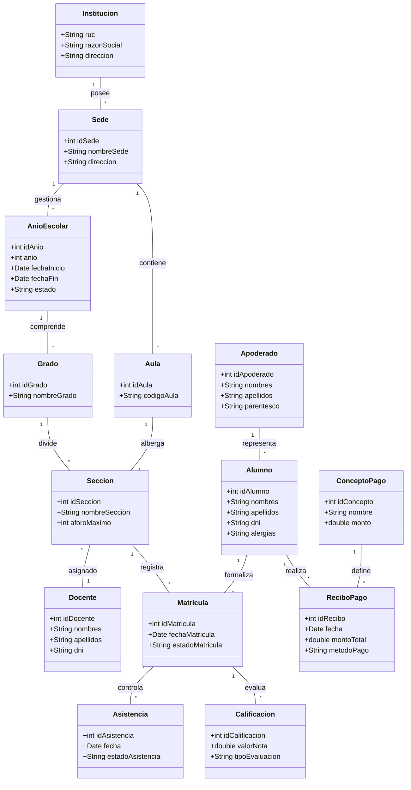

# **3\. MODELO DE ANÁLISIS**

*El Modelo de Análisis transforma los requerimientos del SRS en modelos visuales que muestran QUÉ debe hacer el sistema (sin decir todavía CÓMO se va a implementar). Incluye el diagrama de casos de uso general, el diagrama de clases de análisis y los diagramas de actividad.*

## **3.1 Diagrama de Casos de Uso General**

El siguiente diagrama detalla los casos de uso definidos para los 6 módulos nucleares de la plataforma **ESCUELITA**, modelando los roles del Super Administrador, Administrador de Sede, Docente, Apoderado y la interacción especial del Chatbot de IA:

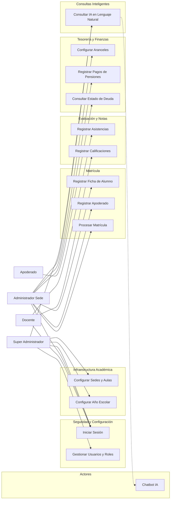

## **3.2 Diagrama de Clases de Análisis**

Este modelo de análisis estructural divide la funcionalidad de matrícula escolar en componentes lógicos de tres capas utilizando estereotipos UML: Interfaz (Boundary), Lógica de Negocio (Control) y Persistencia de Datos (Entity):

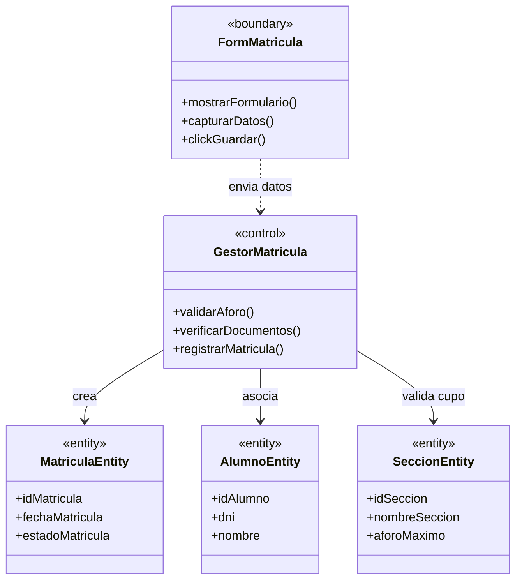

## **3.3 Diagramas de Actividad**

### **3.3.1 Diagrama de Actividad — Proceso de Matrícula**

Detalla la secuencia de pasos lógicos requerida para registrar y formalizar la matrícula de un estudiante en la I.E. Saber Wassi:

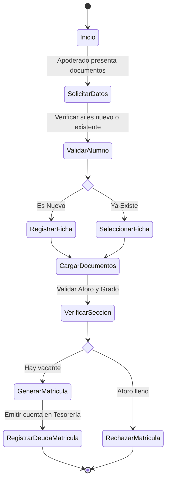

### **3.3.2 Diagrama de Actividad — Integración con Módulo IA**

Representa el flujo de procesamiento de consultas en lenguaje natural de los usuarios, la traducción a SQL ejecutado sobre la conexión de solo lectura o modificadora permitida, y el formateo final de respuesta:

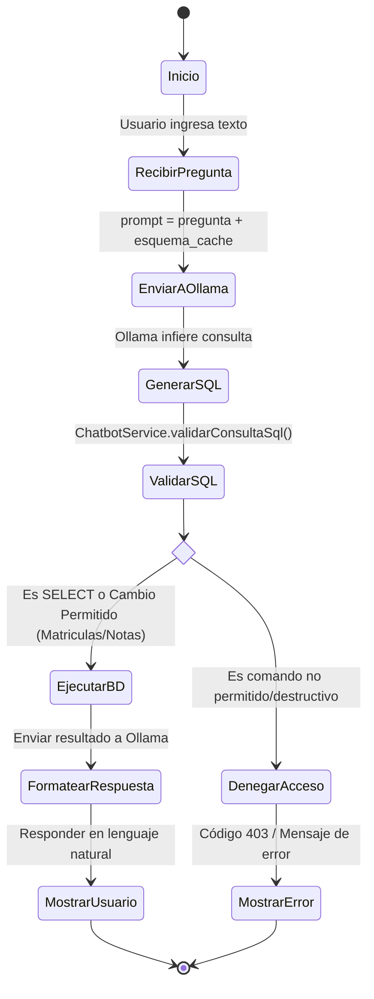

## **3.4 Diagrama de Estados**

El siguiente diagrama modela el ciclo de vida de la entidad **Matrícula** en la base de datos de la escuela:

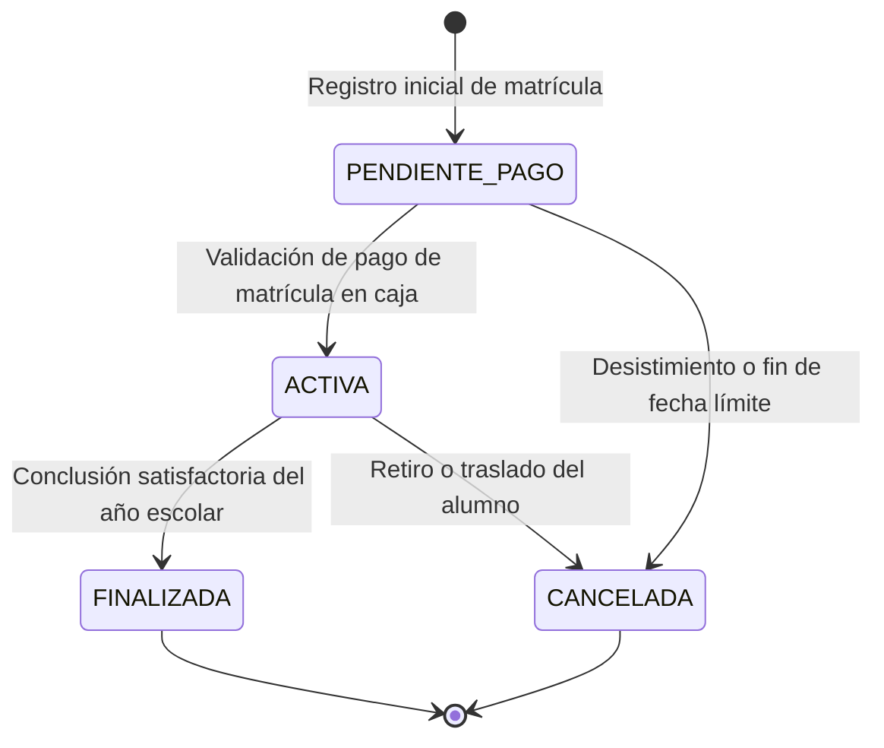

# **4\. CASOS DE USO DETALLADOS**

Esta sección especifica en detalle los 32 casos de uso identificados del sistema, agrupados por módulo funcional. Cada tabla incluye el actor responsable, precondiciones, flujos principal y alternativo, excepciones y los requerimientos del SRS que implementa.


### **Caso de Uso UC-001: Autenticar Usuario (Iniciar Sesion)**

*El sistema tiene dos endpoints de autenticación separados según el tipo de usuario (SuperAdmin vs Escuela). Valida el estado activo de la cuenta, migra automáticamente contraseñas de texto plano a BCrypt hash, y verifica la suscripción institucional.*

| Campo | Descripción |
| :---- | :---- |
| **ID del Caso de Uso** | UC-001 |
| **Nombre** | Autenticar Usuario (Iniciar Sesion) |
| **Actor Primario** | SuperAdmin / Admin / Profesor / Tesoreria |
| **Actores Secundarios** | BD MySQL, JwtUtil (JJWT 0.12.6), SuscripcionValidator |
| **Precondición** | El usuario tiene credenciales registradas y esta activo (estado=1) |
| **Postcondición (éxito)** | Token JWT generado + UsuarioEscuelaDTO con rol, sede, institucion |
| **Postcondición (fallo)** | No se genera sesion; mensaje de error HTTP 401/400 |
| **Endpoint real** | POST /auth/escuela/login <br> POST /auth/admin/login |
| **Flujo Principal** | 1. POST con {usuario, contrasena} 2. findByUsuario() 3. BCrypt.matches() 4. SuscripcionValidator.validar() 5. JwtUtil.generarToken() 6. Retornar EscuelaLoginResponse con token + perfil |
| **Flujo Alternativo A** | A-1: Credenciales incorrectas -> HTTP 400 Bad Request |
| **Flujo de Excepción** | E-1: Usuario inactivo -> 'Usuario inactivo' <br> E-2: Suscripcion vencida -> error suscripcion |
| **Requerimientos relacionados** | RF-MSC-01 (Autenticacion), RNF-Seguridad (JWT, BCrypt) |
| **Prioridad** | MUST |

### **Caso de Uso UC-002: Verificar token de sesion de escuela**

| Campo | Descripción |
| :---- | :---- |
| **ID del Caso de Uso** | UC-002 |
| **Nombre** | Verificar token de sesion de escuela |
| **Actor Primario** | Admin / Profesor / Tesoreria |
| **Actores Secundarios** | JwtUtil, Filtro JWT, BD MySQL |
| **Precondición** | El usuario ya inicio sesion y posee JWT vigente |
| **Postcondición (éxito)** | Token validado y acceso a recursos protegidos |
| **Postcondición (fallo)** | Acceso denegado por token invalido o expirado |
| **Endpoint real** | POST /auth/escuela/verify |
| **Flujo Principal** | 1. Cliente envia token 2. Backend valida firma/claims 3. Se confirma identidad y permisos |
| **Flujo Alternativo A** | A-1: Token ausente o mal formado -> HTTP 401 |
| **Flujo de Excepción** | E-1: Token expirado o firma invalida -> HTTP 401 |
| **Requerimientos relacionados** | RF-MSC-02 (Gestion de Sesion), RNF-Seguridad (JWT) |
| **Prioridad** | MUST |

### **Caso de Uso UC-003: Registrar cuenta SuperAdmin**

| Campo | Descripción |
| :---- | :---- |
| **ID del Caso de Uso** | UC-003 |
| **Nombre** | Registrar cuenta SuperAdmin |
| **Actor Primario** | SuperAdmin |
| **Actores Secundarios** | AdminAuthService, BCryptPasswordEncoder, BD MySQL |
| **Precondición** | Solicitante autorizado para alta de cuenta administrativa |
| **Postcondición (éxito)** | SuperAdmin persistido con contrasena cifrada |
| **Postcondición (fallo)** | Registro rechazado por validacion o conflicto de datos |
| **Endpoint real** | POST /auth/admin/register |
| **Flujo Principal** | 1. POST con datos de usuario 2. Validar payload 3. Cifrar contrasena 4. Guardar en BD 5. Retornar confirmacion |
| **Flujo Alternativo A** | A-1: Usuario ya existe -> HTTP 400/409 |
| **Flujo de Excepción** | E-1: Error de persistencia -> HTTP 500 |
| **Requerimientos relacionados** | RF-MSC-03 (Alta de Administradores), RNF-Seguridad (BCrypt) |
| **Prioridad** | SHOULD |

### **Caso de Uso UC-004: Administrar usuarios por institucion y sede**

| Campo | Descripción |
| :---- | :---- |
| **ID del Caso de Uso** | UC-004 |
| **Nombre** | Administrar usuarios por institucion y sede |
| **Actor Primario** | SuperAdmin / Admin |
| **Actores Secundarios** | UsuariosController, UsuariosService, BD MySQL |
| **Precondición** | Usuario autenticado con permisos de gestion de usuarios |
| **Postcondición (éxito)** | Usuarios creados, listados, actualizados o eliminados |
| **Postcondición (fallo)** | Operacion cancelada por validacion o restricciones de negocio |
| **Endpoint real** | GET /restful/usuarios <br> GET /restful/usuarios/sede/{idSede} <br> GET /restful/usuarios/{id} <br> POST /restful/usuarios <br> PUT /restful/usuarios <br> DELETE /restful/usuarios/{id} <br> GET /restful/usuarios/{idUsuario}/modulos-permisos |
| **Flujo Principal** | 1. Seleccionar operacion CRUD 2. Validar datos 3. Ejecutar servicio 4. Persistir cambios 5. Retornar resultado |
| **Flujo Alternativo A** | A-1: Usuario no encontrado -> HTTP 404 |
| **Flujo de Excepción** | E-1: Violacion de reglas de integridad -> HTTP 400 |
| **Requerimientos relacionados** | RF-ADM-01 (Gestion de Usuarios) |
| **Prioridad** | MUST |

### **Caso de Uso UC-005: Administrar roles y modulos asignados a roles**

| Campo | Descripción |
| :---- | :---- |
| **ID del Caso de Uso** | UC-005 |
| **Nombre** | Administrar roles y modulos asignados a roles |
| **Actor Primario** | SuperAdmin / Admin |
| **Actores Secundarios** | RolesController, ModulosController, BD MySQL |
| **Precondición** | Usuario autenticado con permiso de administracion de roles |
| **Postcondición (éxito)** | Roles y permisos por modulo actualizados |
| **Postcondición (fallo)** | Operacion rechazada por reglas de autorizacion o datos invalidos |
| **Endpoint real** | GET /restful/roles <br> GET /restful/roles/sede/{idSede} <br> GET /restful/roles/{id} <br> POST /restful/roles <br> PUT /restful/roles <br> DELETE /restful/roles/{id} <br> GET /restful/roles/{idRol}/modulos <br> POST /restful/roles/{idRol}/modulos <br> GET /restful/modulos <br> POST /restful/modulos <br> PUT /restful/modulos <br> GET /restful/modulos/{id} <br> DELETE /restful/modulos/{id} |
| **Flujo Principal** | 1. Crear/editar rol 2. Consultar catalogo de modulos 3. Asignar modulos al rol 4. Guardar configuracion |
| **Flujo Alternativo A** | A-1: Rol inexistente -> HTTP 404 |
| **Flujo de Excepción** | E-1: Asignacion inconsistente de modulos -> HTTP 400 |
| **Requerimientos relacionados** | RF-ADM-02 (RBAC por Modulos) |
| **Prioridad** | MUST |

### **Caso de Uso UC-006: Administrar sedes y limites de sedes por suscripcion**

| Campo | Descripción |
| :---- | :---- |
| **ID del Caso de Uso** | UC-006 |
| **Nombre** | Administrar sedes y limites de sedes por suscripcion |
| **Actor Primario** | SuperAdmin |
| **Actores Secundarios** | SedesController, LimitesSedesSuscripcionController, BD MySQL |
| **Precondición** | Existe institucion y suscripcion asociada |
| **Postcondición (éxito)** | Sedes y limites distribuidos (equitativos o personalizados) |
| **Postcondición (fallo)** | No se aplican cambios por validaciones de cupos |
| **Endpoint real** | GET /restful/sedes <br> GET /restful/sedes/{id} <br> POST /restful/sedes <br> PUT /restful/sedes <br> DELETE /restful/sedes/{id} <br> GET /api/limites-sedes/suscripcion/{idSuscripcion} <br> GET /api/limites-sedes/{id} <br> PUT /api/limites-sedes/{id} <br> DELETE /api/limites-sedes/{id} <br> POST /api/limites-sedes/equitativa/{idSuscripcion} <br> POST /api/limites-sedes/personalizada/{idSuscripcion} <br> GET /api/limites-sedes/por-sede/{idSede} |
| **Flujo Principal** | 1. Registrar/actualizar sede 2. Definir limites por suscripcion 3. Guardar distribucion 4. Consultar resultado |
| **Flujo Alternativo A** | A-1: Exceso de sedes permitidas -> HTTP 400 |
| **Flujo de Excepción** | E-1: Suscripcion inexistente -> HTTP 404 |
| **Requerimientos relacionados** | RF-SUS-01 (Sedes por Plan) |
| **Prioridad** | MUST |

### **Caso de Uso UC-007: Administrar datos de institucion educativa**

| Campo | Descripción |
| :---- | :---- |
| **ID del Caso de Uso** | UC-007 |
| **Nombre** | Administrar datos de institucion educativa |
| **Actor Primario** | SuperAdmin / Admin |
| **Actores Secundarios** | InstitucionController, BD MySQL |
| **Precondición** | Usuario autenticado con permisos administrativos |
| **Postcondición (éxito)** | Institucion creada, consultada, actualizada o eliminada |
| **Postcondición (fallo)** | Operacion denegada por validacion o dependencias |
| **Endpoint real** | GET /restful/institucion <br> GET /restful/institucion/{id} <br> POST /restful/institucion <br> PUT /restful/institucion <br> DELETE /restful/institucion/{id} |
| **Flujo Principal** | 1. Ingresar datos institucionales 2. Validar 3. Persistir 4. Confirmar resultado |
| **Flujo Alternativo A** | A-1: Institucion no encontrada -> HTTP 404 |
| **Flujo de Excepción** | E-1: Error de integridad referencial -> HTTP 400 |
| **Requerimientos relacionados** | RF-ORG-01 (Gestion Institucional) |
| **Prioridad** | MUST |

### **Caso de Uso UC-008: Administrar ciclo de vida de suscripciones**

| Campo | Descripción |
| :---- | :---- |
| **ID del Caso de Uso** | UC-008 |
| **Nombre** | Administrar ciclo de vida de suscripciones |
| **Actor Primario** | SuperAdmin |
| **Actores Secundarios** | SuscripcionesController, SuscripcionesService, BD MySQL |
| **Precondición** | Institucion existente y plan disponible |
| **Postcondición (éxito)** | Suscripcion creada/actualizada/cancelada y pagos generados |
| **Postcondición (fallo)** | Operacion no aplicada por estado invalido o reglas de negocio |
| **Endpoint real** | GET /restful/suscripciones <br> GET /restful/suscripciones/{id} <br> GET /restful/suscripciones/por-institucion/{idInstitucion} <br> POST /restful/suscripciones <br> PUT /restful/suscripciones <br> DELETE /restful/suscripciones/{id} <br> PUT /restful/suscripciones/{id}/cancelar <br> POST /restful/suscripciones/generar-pagos-todas <br> POST /restful/suscripciones/{id}/generar-pagos |
| **Flujo Principal** | 1. Crear o modificar suscripcion 2. Validar vigencia 3. Generar cronograma de pagos 4. Persistir estado |
| **Flujo Alternativo A** | A-1: Suscripcion no encontrada -> HTTP 404 |
| **Flujo de Excepción** | E-1: Cancelacion en estado no permitido -> HTTP 400 |
| **Requerimientos relacionados** | RF-SUS-02 (Gestion de Suscripciones) |
| **Prioridad** | MUST |

### **Caso de Uso UC-009: Administrar planes, estados y ciclos de facturacion**

| Campo | Descripción |
| :---- | :---- |
| **ID del Caso de Uso** | UC-009 |
| **Nombre** | Administrar planes, estados y ciclos de facturacion |
| **Actor Primario** | SuperAdmin |
| **Actores Secundarios** | PlanesController, EstadosSuscripcionController, CiclosFacturacionController |
| **Precondición** | Usuario autenticado con permisos de configuracion |
| **Postcondición (éxito)** | Catalogos de suscripcion mantenidos en sistema |
| **Postcondición (fallo)** | Cambios no aplicados por validaciones de negocio |
| **Endpoint real** | GET /restful/planes <br> GET /restful/planes/{id} <br> POST /restful/planes <br> PUT /restful/planes <br> DELETE /restful/planes/{id} <br> GET /restful/estadossuscripcion <br> GET /restful/estadossuscripcion/{id} <br> POST /restful/estadossuscripcion <br> PUT /restful/estadossuscripcion <br> DELETE /restful/estadossuscripcion/{id} <br> GET /restful/ciclosfacturacion <br> GET /restful/ciclosfacturacion/{id} <br> POST /restful/ciclosfacturacion <br> PUT /restful/ciclosfacturacion <br> DELETE /restful/ciclosfacturacion/{id} |
| **Flujo Principal** | 1. Seleccionar catalogo 2. Ejecutar CRUD 3. Validar consistencia 4. Guardar |
| **Flujo Alternativo A** | A-1: Registro inexistente -> HTTP 404 |
| **Flujo de Excepción** | E-1: Catalogo en uso no eliminable -> HTTP 400 |
| **Requerimientos relacionados** | RF-SUS-03 (Catalogos de Suscripcion) |
| **Prioridad** | SHOULD |

### **Caso de Uso UC-010: Registrar, verificar y auditar pagos de suscripcion**

| Campo | Descripción |
| :---- | :---- |
| **ID del Caso de Uso** | UC-010 |
| **Nombre** | Registrar, verificar y auditar pagos de suscripcion |
| **Actor Primario** | SuperAdmin / Tesoreria |
| **Actores Secundarios** | PagoSuscripcionController, almacenamiento de comprobantes, BD MySQL |
| **Precondición** | Suscripcion activa con cuotas pendientes o en proceso |
| **Postcondición (éxito)** | Pago registrado/verificado/rechazado con evidencia documental |
| **Postcondición (fallo)** | Pago no actualizado por validacion de estado o archivo |
| **Endpoint real** | GET /restful/pagos-suscripcion/{id} <br> DELETE /restful/pagos-suscripcion/{id} <br> POST /restful/pagos-suscripcion/registrar <br> PUT /restful/pagos-suscripcion/{id}/actualizar-comprobante <br> PUT /restful/pagos-suscripcion/{id}/verificar <br> PUT /restful/pagos-suscripcion/{id}/rechazar <br> GET /restful/pagos-suscripcion/suscripcion/{idSuscripcion} <br> GET /restful/pagos-suscripcion/pendientes <br> GET /restful/pagos-suscripcion/estado/{estado} <br> GET /restful/pagos-suscripcion/rango <br> GET /restful/pagos-suscripcion/comprobante/{filename} <br> GET /restful/pagos-suscripcion/comprobante/{filename}/descargar <br> GET /restful/pagos-suscripcion/estadisticas |
| **Flujo Principal** | 1. Registrar pago con comprobante 2. Revisar en bandeja de pendientes 3. Verificar o rechazar 4. Consultar estadisticas |
| **Flujo Alternativo A** | A-1: Comprobante invalido/no adjunto -> HTTP 400 |
| **Flujo de Excepción** | E-1: Archivo no encontrado -> HTTP 404 |
| **Requerimientos relacionados** | RF-SUS-04 (Cobranza de Suscripciones) |
| **Prioridad** | MUST |

### **Caso de Uso UC-011: Administrar cuentas SuperAdmin**

| Campo | Descripción |
| :---- | :---- |
| **ID del Caso de Uso** | UC-011 |
| **Nombre** | Administrar cuentas SuperAdmin |
| **Actor Primario** | SuperAdmin |
| **Actores Secundarios** | SuperAdminsController, BD MySQL |
| **Precondición** | Usuario autenticado con privilegios globales |
| **Postcondición (éxito)** | SuperAdmins gestionados por CRUD |
| **Postcondición (fallo)** | Operacion rechazada por reglas de seguridad |
| **Endpoint real** | GET /restful/superadmins <br> GET /restful/superadmins/{id} <br> POST /restful/superadmins <br> PUT /restful/superadmins <br> DELETE /restful/superadmins/{id} |
| **Flujo Principal** | 1. Seleccionar operacion 2. Validar 3. Persistir 4. Confirmar |
| **Flujo Alternativo A** | A-1: SuperAdmin inexistente -> HTTP 404 |
| **Flujo de Excepción** | E-1: Restriccion de integridad -> HTTP 400 |
| **Requerimientos relacionados** | RF-ADM-03 (Administradores Globales) |
| **Prioridad** | SHOULD |

### **Caso de Uso UC-012: Administrar anio escolar y periodos**

| Campo | Descripción |
| :---- | :---- |
| **ID del Caso de Uso** | UC-012 |
| **Nombre** | Administrar anio escolar y periodos |
| **Actor Primario** | Admin |
| **Actores Secundarios** | AnioEscolarController, PeriodosController, BD MySQL |
| **Precondición** | Institucion y sede configuradas |
| **Postcondición (éxito)** | Calendario academico actualizado |
| **Postcondición (fallo)** | Cambios rechazados por solapamientos o validaciones |
| **Endpoint real** | GET /restful/anioescolar <br> GET /restful/anioescolar/{id} <br> POST /restful/anioescolar <br> PUT /restful/anioescolar <br> DELETE /restful/anioescolar/{id} <br> GET /restful/periodos <br> GET /restful/periodos/{id} <br> POST /restful/periodos <br> PUT /restful/periodos <br> DELETE /restful/periodos/{id} |
| **Flujo Principal** | 1. Crear anio escolar 2. Definir periodos 3. Guardar 4. Consultar configuracion |
| **Flujo Alternativo A** | A-1: Periodo duplicado -> HTTP 400 |
| **Flujo de Excepción** | E-1: Registros relacionados impiden eliminar -> HTTP 400 |
| **Requerimientos relacionados** | RF-ACA-01 (Calendario Academico) |
| **Prioridad** | MUST |

### **Caso de Uso UC-013: Administrar grados, secciones y aulas**

| Campo | Descripción |
| :---- | :---- |
| **ID del Caso de Uso** | UC-013 |
| **Nombre** | Administrar grados, secciones y aulas |
| **Actor Primario** | Admin |
| **Actores Secundarios** | GradosController, SeccionesController, AulasController, BD MySQL |
| **Precondición** | Sede existente |
| **Postcondición (éxito)** | Estructura fisica y organizativa disponible para matricula |
| **Postcondición (fallo)** | Operacion no aplicada por inconsistencias de datos |
| **Endpoint real** | GET /restful/grados <br> GET /restful/grados/{id} <br> POST /restful/grados <br> PUT /restful/grados <br> DELETE /restful/grados/{id} <br> GET /restful/secciones <br> GET /restful/secciones/{id} <br> POST /restful/secciones <br> PUT /restful/secciones <br> DELETE /restful/secciones/{id} <br> GET /restful/aulas <br> GET /restful/aulas/{id} <br> POST /restful/aulas <br> PUT /restful/aulas <br> DELETE /restful/aulas/{id} |
| **Flujo Principal** | 1. Configurar grados 2. Asociar secciones 3. Definir aulas 4. Persistir |
| **Flujo Alternativo A** | A-1: Recurso no encontrado -> HTTP 404 |
| **Flujo de Excepción** | E-1: Dependencia activa impide eliminacion -> HTTP 400 |
| **Requerimientos relacionados** | RF-ACA-02 (Estructura Escolar) |
| **Prioridad** | MUST |

### **Caso de Uso UC-014: Administrar areas, cursos, especialidades y malla curricular**

| Campo | Descripción |
| :---- | :---- |
| **ID del Caso de Uso** | UC-014 |
| **Nombre** | Administrar areas, cursos, especialidades y malla curricular |
| **Actor Primario** | Admin / Coordinador Academico |
| **Actores Secundarios** | AreasController, CursosController, EspecialidadesController, MallaCurricularController |
| **Precondición** | Grados/periodos disponibles |
| **Postcondición (éxito)** | Oferta academica estructurada por grado y periodo |
| **Postcondición (fallo)** | No se guardan cambios por validaciones curriculares |
| **Endpoint real** | GET /restful/areas <br> POST /restful/areas <br> PUT /restful/areas <br> DELETE /restful/areas/{id} <br> GET /restful/cursos <br> POST /restful/cursos <br> PUT /restful/cursos <br> DELETE /restful/cursos/{id} <br> GET /restful/especialidades <br> GET /restful/especialidades/{id} <br> POST /restful/especialidades <br> PUT /restful/especialidades <br> DELETE /restful/especialidades/{id} <br> GET /restful/mallacurricular <br> GET /restful/mallacurricular/{id} <br> POST /restful/mallacurricular <br> PUT /restful/mallacurricular <br> DELETE /restful/mallacurricular/{id} |
| **Flujo Principal** | 1. Crear catalogos academicos 2. Asignarlos a malla 3. Validar estructura 4. Guardar |
| **Flujo Alternativo A** | A-1: Curso o area inexistente -> HTTP 404 |
| **Flujo de Excepción** | E-1: Duplicidad de configuracion curricular -> HTTP 400 |
| **Requerimientos relacionados** | RF-ACA-03 (Malla Curricular) |
| **Prioridad** | MUST |

### **Caso de Uso UC-015: Administrar evaluaciones, tipos de evaluacion y tipos de nota**

| Campo | Descripción |
| :---- | :---- |
| **ID del Caso de Uso** | UC-015 |
| **Nombre** | Administrar evaluaciones, tipos de evaluacion y tipos de nota |
| **Actor Primario** | Profesor / Coordinador Academico |
| **Actores Secundarios** | EvaluacionesController, TiposEvaluacionController, TiposNotaController |
| **Precondición** | Curso y periodo activos |
| **Postcondición (éxito)** | Evaluaciones y reglas de calificacion registradas |
| **Postcondición (fallo)** | Evaluacion no creada por validacion de parametros |
| **Endpoint real** | GET /restful/evaluaciones <br> GET /restful/evaluaciones/{id} <br> POST /restful/evaluaciones <br> PUT /restful/evaluaciones <br> DELETE /restful/evaluaciones/{id} <br> GET /restful/tiposevaluacion <br> GET /restful/tiposevaluacion/{id} <br> POST /restful/tiposevaluacion <br> PUT /restful/tiposevaluacion <br> DELETE /restful/tiposevaluacion/{id} <br> GET /restful/tiposnota <br> GET /restful/tiposnota/{id} <br> POST /restful/tiposnota <br> PUT /restful/tiposnota <br> DELETE /restful/tiposnota/{id} |
| **Flujo Principal** | 1. Definir tipo de evaluacion 2. Definir escala/tipo de nota 3. Crear evaluacion 4. Publicar |
| **Flujo Alternativo A** | A-1: Datos incompletos -> HTTP 400 |
| **Flujo de Excepción** | E-1: Curso no habilitado -> HTTP 400 |
| **Requerimientos relacionados** | RF-ACA-04 (Evaluaciones) |
| **Prioridad** | MUST |

### **Caso de Uso UC-016: Registrar calificaciones y calcular promedios por periodo**

| Campo | Descripción |
| :---- | :---- |
| **ID del Caso de Uso** | UC-016 |
| **Nombre** | Registrar calificaciones y calcular promedios por periodo |
| **Actor Primario** | Profesor |
| **Actores Secundarios** | CalificacionesController, PromediosPeriodoController |
| **Precondición** | Evaluaciones creadas y alumno matriculado |
| **Postcondición (éxito)** | Notas y promedios almacenados |
| **Postcondición (fallo)** | Registro rechazado por reglas de rango o estado academico |
| **Endpoint real** | GET /restful/calificaciones <br> GET /restful/calificaciones/{id} <br> POST /restful/calificaciones <br> PUT /restful/calificaciones <br> DELETE /restful/calificaciones/{id} <br> GET /restful/promediosperiodo <br> GET /restful/promediosperiodo/{id} <br> POST /restful/promediosperiodo <br> PUT /restful/promediosperiodo <br> DELETE /restful/promediosperiodo/{id} |
| **Flujo Principal** | 1. Ingresar notas por evaluacion 2. Validar escala 3. Calcular/guardar promedio 4. Confirmar |
| **Flujo Alternativo A** | A-1: Nota fuera de rango -> HTTP 400 |
| **Flujo de Excepción** | E-1: Alumno sin matricula activa -> HTTP 400 |
| **Requerimientos relacionados** | RF-ACA-05 (Calificaciones y Promedios) |
| **Prioridad** | MUST |

### **Caso de Uso UC-017: Consultar reporte academico consolidado**

| Campo | Descripción |
| :---- | :---- |
| **ID del Caso de Uso** | UC-017 |
| **Nombre** | Consultar reporte academico consolidado |
| **Actor Primario** | Admin / Profesor / Apoderado (segun permisos) |
| **Actores Secundarios** | ReporteAcademicoController, ReporteAcademicoService |
| **Precondición** | Existen datos de evaluaciones y calificaciones |
| **Postcondición (éxito)** | Reporte academico disponible para consulta |
| **Postcondición (fallo)** | No se obtiene reporte por ausencia de datos o error de filtro |
| **Endpoint real** | GET /restful/reportes/academico |
| **Flujo Principal** | 1. Solicitar reporte con criterios 2. Consultar datos agregados 3. Retornar reporte |
| **Flujo Alternativo A** | A-1: Sin resultados -> respuesta vacia/HTTP 200 |
| **Flujo de Excepción** | E-1: Parametros invalidos -> HTTP 400 |
| **Requerimientos relacionados** | RF-REP-01 (Reportes Academicos) |
| **Prioridad** | SHOULD |

### **Caso de Uso UC-018: Administrar ficha de alumnos**

| Campo | Descripción |
| :---- | :---- |
| **ID del Caso de Uso** | UC-018 |
| **Nombre** | Administrar ficha de alumnos |
| **Actor Primario** | Admin / Secretaria |
| **Actores Secundarios** | AlumnosController, BD MySQL |
| **Precondición** | Sede y estructura academica configuradas |
| **Postcondición (éxito)** | Alumno creado, actualizado, consultado o eliminado |
| **Postcondición (fallo)** | Operacion no aplicada por validaciones de identidad/estado |
| **Endpoint real** | GET /restful/alumnos <br> GET /restful/alumnos/{id} <br> POST /restful/alumnos <br> PUT /restful/alumnos <br> DELETE /restful/alumnos/{id} |
| **Flujo Principal** | 1. Registrar/editar datos del alumno 2. Validar 3. Guardar 4. Confirmar |
| **Flujo Alternativo A** | A-1: Alumno no encontrado -> HTTP 404 |
| **Flujo de Excepción** | E-1: Documento duplicado -> HTTP 400 |
| **Requerimientos relacionados** | RF-ALU-01 (Gestion de Alumnos) |
| **Prioridad** | MUST |

### **Caso de Uso UC-019: Administrar apoderados y relacion alumno-apoderado**

| Campo | Descripción |
| :---- | :---- |
| **ID del Caso de Uso** | UC-019 |
| **Nombre** | Administrar apoderados y relacion alumno-apoderado |
| **Actor Primario** | Admin / Secretaria |
| **Actores Secundarios** | ApoderadosController, AlumnoApoderadoController |
| **Precondición** | Alumno existente |
| **Postcondición (éxito)** | Apoderado registrado y vinculado a alumno |
| **Postcondición (fallo)** | Vinculacion rechazada por inconsistencia de datos |
| **Endpoint real** | GET /restful/apoderados <br> GET /restful/apoderados/{id} <br> POST /restful/apoderados <br> PUT /restful/apoderados <br> DELETE /restful/apoderados/{id} <br> GET /restful/alumnoapoderado <br> GET /restful/alumnoapoderado/{id} <br> POST /restful/alumnoapoderado <br> PUT /restful/alumnoapoderado <br> DELETE /restful/alumnoapoderado/{id} |
| **Flujo Principal** | 1. Registrar apoderado 2. Crear relacion con alumno 3. Guardar 4. Consultar relacion |
| **Flujo Alternativo A** | A-1: Alumno o apoderado inexistente -> HTTP 404 |
| **Flujo de Excepción** | E-1: Relacion duplicada -> HTTP 400 |
| **Requerimientos relacionados** | RF-ALU-02 (Apoderados) |
| **Prioridad** | MUST |

### **Caso de Uso UC-020: Registrar matriculas y confirmar pago**

| Campo | Descripción |
| :---- | :---- |
| **ID del Caso de Uso** | UC-020 |
| **Nombre** | Registrar matriculas y confirmar pago |
| **Actor Primario** | Admin / Tesoreria |
| **Actores Secundarios** | MatriculasController, BD MySQL |
| **Precondición** | Alumno activo y cupo disponible |
| **Postcondición (éxito)** | Matricula creada y estado de pago actualizado |
| **Postcondición (fallo)** | Matricula no registrada por falta de vacantes o validaciones |
| **Endpoint real** | GET /restful/matriculas <br> GET /restful/matriculas/{id} <br> POST /restful/matriculas <br> PUT /restful/matriculas <br> DELETE /restful/matriculas/{id} <br> PUT /restful/matriculas/{id}/confirmar-pago <br> GET /restful/matriculas/vacantes-disponibles |
| **Flujo Principal** | 1. Verificar vacantes 2. Registrar matricula 3. Confirmar pago 4. Actualizar estado |
| **Flujo Alternativo A** | A-1: Sin vacantes -> HTTP 400 |
| **Flujo de Excepción** | E-1: Matricula no encontrada -> HTTP 404 |
| **Requerimientos relacionados** | RF-MAT-01 (Matriculas) |
| **Prioridad** | MUST |

### **Caso de Uso UC-021: Registrar y consultar asistencia de alumnos**

| Campo | Descripción |
| :---- | :---- |
| **ID del Caso de Uso** | UC-021 |
| **Nombre** | Registrar y consultar asistencia de alumnos |
| **Actor Primario** | Profesor |
| **Actores Secundarios** | AsistenciasController, BD MySQL |
| **Precondición** | Matricula activa y horario vigente |
| **Postcondición (éxito)** | Asistencia registrada y disponible para consulta |
| **Postcondición (fallo)** | Registro no aplicado por validaciones |
| **Endpoint real** | GET /restful/asistencias <br> GET /restful/asistencias/{id} <br> POST /restful/asistencias <br> PUT /restful/asistencias <br> DELETE /restful/asistencias/{id} |
| **Flujo Principal** | 1. Seleccionar seccion/fecha 2. Registrar estado de asistencia 3. Guardar 4. Consultar historico |
| **Flujo Alternativo A** | A-1: Registro inexistente -> HTTP 404 |
| **Flujo de Excepción** | E-1: Duplicidad de asistencia del dia -> HTTP 400 |
| **Requerimientos relacionados** | RF-ACA-06 (Asistencias) |
| **Prioridad** | MUST |

### **Caso de Uso UC-022: Configurar horarios academicos**

| Campo | Descripción |
| :---- | :---- |
| **ID del Caso de Uso** | UC-022 |
| **Nombre** | Configurar horarios academicos |
| **Actor Primario** | Admin / Coordinador Academico |
| **Actores Secundarios** | HorariosController, BD MySQL |
| **Precondición** | Grado, seccion, aula y docentes disponibles |
| **Postcondición (éxito)** | Horario publicado para operacion academica |
| **Postcondición (fallo)** | Horario rechazado por conflicto de franjas |
| **Endpoint real** | GET /restful/horarios <br> GET /restful/horarios/{id} <br> POST /restful/horarios <br> PUT /restful/horarios <br> DELETE /restful/horarios/{id} |
| **Flujo Principal** | 1. Definir bloques horarios 2. Asignar recursos 3. Validar conflictos 4. Guardar |
| **Flujo Alternativo A** | A-1: Horario no encontrado -> HTTP 404 |
| **Flujo de Excepción** | E-1: Cruce horario docente/aula -> HTTP 400 |
| **Requerimientos relacionados** | RF-ACA-07 (Horarios) |
| **Prioridad** | SHOULD |

### **Caso de Uso UC-023: Administrar perfil docente y asignacion docente**

| Campo | Descripción |
| :---- | :---- |
| **ID del Caso de Uso** | UC-023 |
| **Nombre** | Administrar perfil docente y asignacion docente |
| **Actor Primario** | Admin / Coordinador Academico |
| **Actores Secundarios** | PerfilDocenteController, AsignacionDocenteController |
| **Precondición** | Usuario docente existente en sistema |
| **Postcondición (éxito)** | Perfil docente y asignaciones academicas registradas |
| **Postcondición (fallo)** | No se asigna por inconsistencias de carga academica |
| **Endpoint real** | GET /restful/perfildocente <br> GET /restful/perfildocente/{id} <br> POST /restful/perfildocente <br> PUT /restful/perfildocente <br> DELETE /restful/perfildocente/{id} <br> GET /restful/asignaciondocente <br> GET /restful/asignaciondocente/{id} <br> POST /restful/asignaciondocente <br> PUT /restful/asignaciondocente <br> DELETE /restful/asignaciondocente/{id} |
| **Flujo Principal** | 1. Completar perfil docente 2. Asignar cursos/secciones 3. Validar disponibilidad 4. Guardar |
| **Flujo Alternativo A** | A-1: Docente no encontrado -> HTTP 404 |
| **Flujo de Excepción** | E-1: Doble asignacion incompatible -> HTTP 400 |
| **Requerimientos relacionados** | RF-DOC-01 (Gestion Docente) |
| **Prioridad** | SHOULD |

### **Caso de Uso UC-024: Administrar registros y generar token de soporte**

| Campo | Descripción |
| :---- | :---- |
| **ID del Caso de Uso** | UC-024 |
| **Nombre** | Administrar registros y generar token de soporte |
| **Actor Primario** | SuperAdmin / Admin |
| **Actores Secundarios** | RegistrosController |
| **Precondición** | Usuario autenticado |
| **Postcondición (éxito)** | Registros operativos mantenidos y token generado cuando aplica |
| **Postcondición (fallo)** | Operacion no ejecutada por validacion |
| **Endpoint real** | GET /restful/registros <br> GET /restful/registros/{id} <br> POST /restful/registros <br> PUT /restful/registros <br> DELETE /restful/registros/{id} <br> POST /restful/token |
| **Flujo Principal** | 1. Ejecutar operacion sobre registros 2. Persistir 3. Opcional: generar token tecnico |
| **Flujo Alternativo A** | A-1: Registro inexistente -> HTTP 404 |
| **Flujo de Excepción** | E-1: Error interno al emitir token -> HTTP 500 |
| **Requerimientos relacionados** | RF-OPS-01 (Registros y Trazabilidad) |
| **Prioridad** | SHOULD |

### **Caso de Uso UC-025: Administrar conceptos y metodos de pago**

| Campo | Descripción |
| :---- | :---- |
| **ID del Caso de Uso** | UC-025 |
| **Nombre** | Administrar conceptos y metodos de pago |
| **Actor Primario** | Tesoreria / Admin |
| **Actores Secundarios** | ConceptosPagoController, MetodosPagoController |
| **Precondición** | Usuario con permisos de tesoreria |
| **Postcondición (éxito)** | Catalogo de conceptos y metodos actualizado |
| **Postcondición (fallo)** | Cambios no aplicados por validacion o dependencia |
| **Endpoint real** | GET /restful/conceptospago <br> GET /restful/conceptospago/{id} <br> POST /restful/conceptospago <br> PUT /restful/conceptospago <br> DELETE /restful/conceptospago/{id} <br> GET /restful/metodospago <br> GET /restful/metodospago/{id} <br> POST /restful/metodospago <br> PUT /restful/metodospago <br> DELETE /restful/metodospago/{id} |
| **Flujo Principal** | 1. Definir conceptos de cobro 2. Definir metodos de pago 3. Guardar catalogos |
| **Flujo Alternativo A** | A-1: Registro inexistente -> HTTP 404 |
| **Flujo de Excepción** | E-1: Concepto en uso no eliminable -> HTTP 400 |
| **Requerimientos relacionados** | RF-PAG-01 (Configuracion de Cobros) |
| **Prioridad** | SHOULD |

### **Caso de Uso UC-026: Registrar y consultar deudas de alumnos**

| Campo | Descripción |
| :---- | :---- |
| **ID del Caso de Uso** | UC-026 |
| **Nombre** | Registrar y consultar deudas de alumnos |
| **Actor Primario** | Tesoreria |
| **Actores Secundarios** | DeudasAlumnoController, BD MySQL |
| **Precondición** | Alumno con matricula asociada |
| **Postcondición (éxito)** | Deuda creada/actualizada y visible en consulta |
| **Postcondición (fallo)** | Operacion rechazada por validaciones de estado |
| **Endpoint real** | GET /restful/deudasalumno <br> GET /restful/deudasalumno/{id} <br> POST /restful/deudasalumno <br> PUT /restful/deudasalumno <br> DELETE /restful/deudasalumno/{id} |
| **Flujo Principal** | 1. Registrar deuda 2. Actualizar estado 3. Consultar cartera |
| **Flujo Alternativo A** | A-1: Deuda no encontrada -> HTTP 404 |
| **Flujo de Excepción** | E-1: Monto o datos invalidos -> HTTP 400 |
| **Requerimientos relacionados** | RF-PAG-02 (Cuentas por Cobrar) |
| **Prioridad** | MUST |

### **Caso de Uso UC-027: Registrar pagos en caja y detalle de operaciones**

| Campo | Descripción |
| :---- | :---- |
| **ID del Caso de Uso** | UC-027 |
| **Nombre** | Registrar pagos en caja y detalle de operaciones |
| **Actor Primario** | Tesoreria |
| **Actores Secundarios** | PagosCajaController, PagoDetalleController |
| **Precondición** | Existen deudas o conceptos de pago aplicables |
| **Postcondición (éxito)** | Pagos de caja y sus detalles quedan registrados |
| **Postcondición (fallo)** | Pago no procesado por validacion |
| **Endpoint real** | GET /restful/pagoscaja <br> GET /restful/pagoscaja/{id} <br> POST /restful/pagoscaja <br> PUT /restful/pagoscaja <br> DELETE /restful/pagoscaja/{id} <br> GET /restful/pagodetalle <br> GET /restful/pagodetalle/{id} <br> POST /restful/pagodetalle <br> PUT /restful/pagodetalle <br> DELETE /restful/pagodetalle/{id} |
| **Flujo Principal** | 1. Registrar pago de caja 2. Registrar detalle de conceptos 3. Guardar |
| **Flujo Alternativo A** | A-1: Pago no encontrado -> HTTP 404 |
| **Flujo de Excepción** | E-1: Inconsistencia entre cabecera y detalle -> HTTP 400 |
| **Requerimientos relacionados** | RF-PAG-03 (Caja) |
| **Prioridad** | MUST |

### **Caso de Uso UC-028: Registrar, aprobar o rechazar movimientos del alumno**

| Campo | Descripción |
| :---- | :---- |
| **ID del Caso de Uso** | UC-028 |
| **Nombre** | Registrar, aprobar o rechazar movimientos del alumno |
| **Actor Primario** | Admin / Tesoreria / Secretaria |
| **Actores Secundarios** | MovimientosAlumnoController |
| **Precondición** | Alumno y matricula existentes |
| **Postcondición (éxito)** | Movimiento almacenado y estado actualizado (pendiente/aprobado/rechazado) |
| **Postcondición (fallo)** | Movimiento no procesado por reglas de negocio |
| **Endpoint real** | GET /restful/movimientos-alumno <br> GET /restful/movimientos-alumno/{id} <br> GET /restful/movimientos-alumno/matricula/{idMatricula} <br> GET /restful/movimientos-alumno/alumno/{idAlumno} <br> GET /restful/movimientos-alumno/pendientes <br> GET /restful/movimientos-alumno/tipo/{tipo} <br> POST /restful/movimientos-alumno <br> PUT /restful/movimientos-alumno/{id}/aprobar <br> PUT /restful/movimientos-alumno/{id}/rechazar <br> PUT /restful/movimientos-alumno/{id} <br> DELETE /restful/movimientos-alumno/{id} |
| **Flujo Principal** | 1. Registrar movimiento 2. Revisar pendientes 3. Aprobar/rechazar 4. Actualizar historial |
| **Flujo Alternativo A** | A-1: Movimiento inexistente -> HTTP 404 |
| **Flujo de Excepción** | E-1: Transicion de estado no permitida -> HTTP 400 |
| **Requerimientos relacionados** | RF-ALU-03 (Movimientos Administrativos) |
| **Prioridad** | SHOULD |

### **Caso de Uso UC-029: Administrar tipos de documento, requisitos y documentos de alumno**

| Campo | Descripción |
| :---- | :---- |
| **ID del Caso de Uso** | UC-029 |
| **Nombre** | Administrar tipos de documento, requisitos y documentos de alumno |
| **Actor Primario** | Admin / Secretaria |
| **Actores Secundarios** | TipoDocumentosController, RequisitosDocumentosController, DocumentosAlumnoController |
| **Precondición** | Alumno registrado y reglas documentarias definidas |
| **Postcondición (éxito)** | Expediente documentario actualizado |
| **Postcondición (fallo)** | Documento no registrado por validacion |
| **Endpoint real** | GET /restful/tipodocumentos <br> GET /restful/tipodocumentos/{id} <br> POST /restful/tipodocumentos <br> PUT /restful/tipodocumentos <br> DELETE /restful/tipodocumentos/{id} <br> GET /restful/requisitosdocumentos <br> GET /restful/requisitosdocumentos/{id} <br> POST /restful/requisitosdocumentos <br> PUT /restful/requisitosdocumentos <br> DELETE /restful/requisitosdocumentos/{id} <br> GET /restful/documentosalumno <br> GET /restful/documentosalumno/{id} <br> POST /restful/documentosalumno <br> PUT /restful/documentosalumno <br> DELETE /restful/documentosalumno/{id} |
| **Flujo Principal** | 1. Configurar requisitos 2. Registrar documentos presentados 3. Consultar estado de expediente |
| **Flujo Alternativo A** | A-1: Requisito inexistente -> HTTP 404 |
| **Flujo de Excepción** | E-1: Archivo/documento invalido -> HTTP 400 |
| **Requerimientos relacionados** | RF-DOC-01 (Expediente del Alumno) |
| **Prioridad** | SHOULD |

### **Caso de Uso UC-030: Subir archivos generales, documentos y avatares**

| Campo | Descripción |
| :---- | :---- |
| **ID del Caso de Uso** | UC-030 |
| **Nombre** | Subir archivos generales, documentos y avatares |
| **Actor Primario** | Admin / Secretaria / Usuario autenticado |
| **Actores Secundarios** | FileUploadController, almacenamiento de archivos |
| **Precondición** | Usuario autenticado y archivo dentro de limites permitidos |
| **Postcondición (éxito)** | Archivo almacenado y ruta disponible para consumo |
| **Postcondición (fallo)** | Carga rechazada por tipo/tamano/permisos |
| **Endpoint real** | POST /restful/files/upload <br> POST /restful/files/upload/document <br> POST /restful/files/upload/avatar |
| **Flujo Principal** | 1. Seleccionar archivo 2. Enviar multipart/form-data 3. Validar 4. Guardar 5. Retornar URL/ruta |
| **Flujo Alternativo A** | A-1: Tipo de archivo no permitido -> HTTP 400 |
| **Flujo de Excepción** | E-1: Error de escritura en almacenamiento -> HTTP 500 |
| **Requerimientos relacionados** | RF-DOC-02 (Gestion de Archivos) |
| **Prioridad** | SHOULD |

### **Caso de Uso UC-031: Consultar datos por DNI en servicio RENIEC**

| Campo | Descripción |
| :---- | :---- |
| **ID del Caso de Uso** | UC-031 |
| **Nombre** | Consultar datos por DNI en servicio RENIEC |
| **Actor Primario** | Admin / Secretaria |
| **Actores Secundarios** | ReniecController, proveedor externo RENIEC |
| **Precondición** | DNI valido y servicio externo disponible |
| **Postcondición (éxito)** | Datos de identidad recuperados para apoyo al registro |
| **Postcondición (fallo)** | No se retorna informacion por DNI invalido o servicio no disponible |
| **Endpoint real** | GET /api/reniec/dni/{dni} |
| **Flujo Principal** | 1. Ingresar DNI 2. Backend consulta RENIEC 3. Retornar datos al cliente |
| **Flujo Alternativo A** | A-1: DNI no encontrado -> respuesta sin datos/HTTP 404 segun implementacion |
| **Flujo de Excepción** | E-1: Timeout o error de proveedor externo -> HTTP 502/500 |
| **Requerimientos relacionados** | RF-INT-01 (Integracion RENIEC) |
| **Prioridad** | COULD |

### **Caso de Uso UC-032: Generar hash utilitario para contrasenas**

| Campo | Descripción |
| :---- | :---- |
| **ID del Caso de Uso** | UC-032 |
| **Nombre** | Generar hash utilitario para contrasenas |
| **Actor Primario** | Desarrollador / Administrador tecnico |
| **Actores Secundarios** | UtilsController, BCrypt |
| **Precondición** | Acceso al endpoint utilitario en entorno permitido |
| **Postcondición (éxito)** | Hash generado para uso tecnico |
| **Postcondición (fallo)** | No se genera hash por entrada invalida |
| **Endpoint real** | POST /utils/generate-hash |
| **Flujo Principal** | 1. Enviar texto plano 2. Generar hash BCrypt 3. Retornar hash |
| **Flujo Alternativo A** | A-1: Entrada vacia -> HTTP 400 |
| **Flujo de Excepción** | E-1: Error interno de libreria -> HTTP 500 |
| **Requerimientos relacionados** | RF-TEC-01 (Utilitarios de Seguridad) |
| **Prioridad** | COULD |

### **Diagrama de Secuencia por Caso de Uso Crítico**

A continuación se presenta el diagrama de secuencia detallado para el caso de uso de **Consulta Inteligente mediante Chatbot IA**, el cual ilustra el flujo de llamadas síncronas entre la interfaz de usuario, los servicios de Spring Boot, Ollama y la base de datos con privilegios controlados:

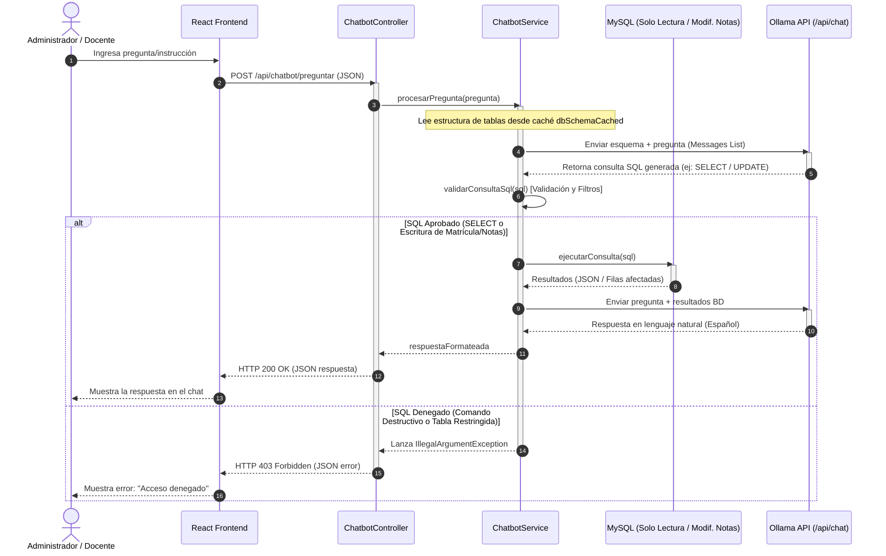

# **5\. ARQUITECTURA DEL SOFTWARE**

*La arquitectura define la estructura general del sistema: en qué capas se divide, cómo se comunican los componentes, en qué tecnologías se implementa cada parte y en qué máquinas se despliega. Es la decisión técnica más importante: una mala arquitectura es difícil y costosa de corregir.*

## **5.1 Descripción de la Arquitectura Elegida**

El **Sistema de Gestión Académica "ESCUELITA"** se estructura bajo un estilo arquitectónico de **Capas Desacopladas (Cliente-Servidor)** apoyado por una Single Page Application (SPA) en el frontend y un backend de Microservicios Monolíticos basado en controladores REST. La justificación de esta arquitectura responde a requerimientos de seguridad e interoperabilidad:

*   **Presentación (React/Vite)**: Capa cliente desacoplada que se ejecuta directamente en el navegador del usuario final, optimizando el rendimiento mediante componentes reactivos.
*   **Lógica de Negocio (Spring Boot)**: Capa intermedia que concentra las reglas del negocio, la seguridad perimetral (JWT + Spring Security) y los flujos conversacionales de la IA.
*   **Módulo de Inteligencia Artificial (Ollama Local)**: Capa analítica independiente integrada en el mismo servidor de aplicación para garantizar costo cero y privacidad de datos.
*   **Persistencia (MySQL)**: Base de datos relacional para el control seguro de transacciones.

## **5.2 Diagrama C4 — Nivel 1: Contexto del Sistema**

Muestra la interacción global de la escuela Saber Wassi y sus diferentes actores con el sistema de software:

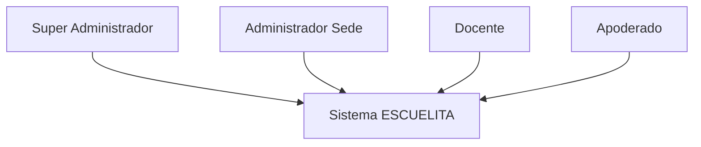

## **5.3 Diagrama C4 — Nivel 2: Contenedores**

Describe los subsistemas de software y base de datos desplegados que integran el ecosistema tecnológico de la escuela:

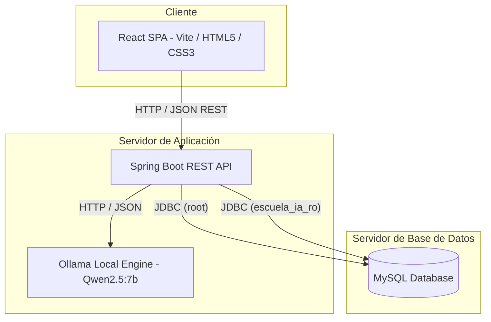

## **5.4 Diagrama C4 — Nivel 3: Componentes**

Abre el contenedor del Backend y detalla los componentes clave implicados en el procesamiento de la lógica de negocio y consultas del chatbot:

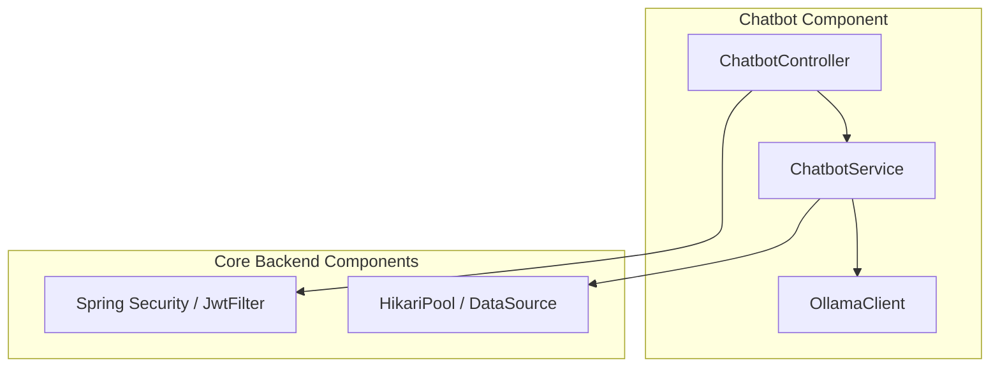

## **5.5 Diagrama de Despliegue**

Detalla la topología de hardware y servidores físicos locales donde opera la solución:

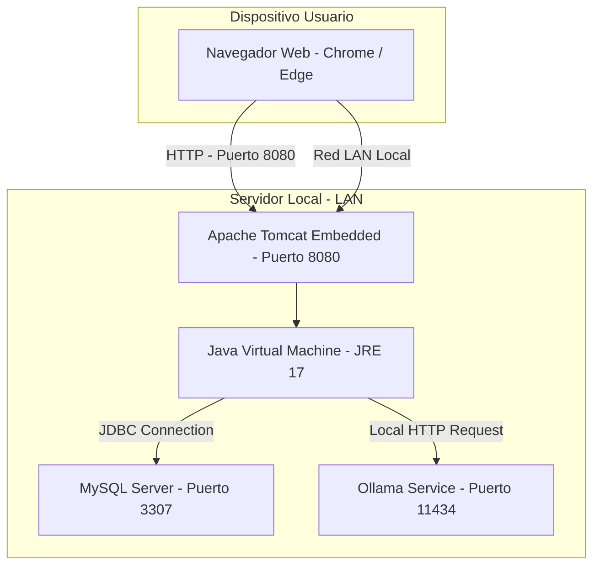

## **5.6 Decisiones Arquitectónicas (ADR)**

| ADR-ID | Decisión tomada | Alternativas evaluadas | Razón de la elección | Consecuencias / Trade-offs |
| ----- | ----- | ----- | ----- | ----- |
| **ADR-001** | Arquitectura de Capas Desacopladas (SPA + REST) | MVC Monolítico (Thymeleaf) | Facilita la modularidad del código y permite que el cliente React se ejecute sin sobrecargar el servidor backend. | Requiere manejo explícito de CORS y autenticación sin estado vía JWT. |
| **ADR-002** | Java Spring Boot como backend | Node.js (Express), Django (Python) | Robustez transaccional requerida para el módulo de tesorería y excelente soporte de Spring Data JPA. | Mayor tiempo inicial de desarrollo y mayor uso de memoria en el servidor. |
| **ADR-003** | Ollama Local (Qwen 2.5:7b) para módulo IA | OpenIA API (ChatGPT), Claude API | Garantiza la confidencialidad total de los datos de los alumnos y elimina costos recurrentes de API. | Exige un servidor físico local con una GPU moderada para obtener tiempos de respuesta rápidos. |
| **ADR-004** | MySQL como base de datos | PostgreSQL, SQL Server | Motor relacional estándar, ligero para entornos locales y con bajo costo de administración. | Menor cantidad de tipos estructurados avanzados nativos en comparación con PostgreSQL. |
| **ADR-005** | Caché del esquema en PostConstruct | Carga del esquema en caliente por consulta | Evita sobrecargar a Ollama enviándole metadatos por consulta, reduciendo el consumo de tokens y optimizando el tiempo de respuesta. | Si se altera la base de datos (DDL), se debe reiniciar el servidor para limpiar la caché. |

## **5.7 Stack Tecnológico**

El entorno de desarrollo y ejecución de **ESCUELITA** está compuesto por las siguientes tecnologías y herramientas:

| Capa | Tecnología | Versión | Justificación |
| ----- | ----- | :---: | ----- |
| **Frontend** | HTML5 / CSS3 / JavaScript | — | Estándares web nativos de estructuración y diseño de interfaces. |
| **Frontend Framework** | React.js (Vite) | 18.x | SPA moderna que agiliza el renderizado de la UI escolar. |
| **Backend** | Java + Spring Boot | 3.2.x | Backend transaccional robusto y seguro de alta productividad. |
| **Motor IA Local** | Ollama Engine | 0.1.x | Motor ejecutor del modelo Qwen2.5:7b para análisis offline. |
| **BD Relacional** | MySQL Server | 8.0 / 3307 | Almacenamiento seguro e indexado de datos institucionales. |
| **ORM** | Spring Data JPA / Hibernate | 6.x | Abstracción del SQL manual para agilizar operaciones CRUD. |
| **Seguridad** | Spring Security + JWT | — | Protección de endpoints y manejo de sesiones sin estado. |
| **IDE Backend** | VS Code / IntelliJ IDEA | — | Entornos integrados de desarrollo utilizados por el equipo. |
| **Control versiones** | Git + GitHub | — | Repositorio centralizado para el versionamiento de código. |

# **6\. PATRONES DE DISEÑO APLICADOS**

## **6.1 Resumen de Patrones Seleccionados**

A continuación se resumen los patrones de diseño Gang of Four (GoF) implementados para estructurar la solución y asegurar el cumplimiento de los principios SOLID:

| Patrón | Categoría GoF | Módulo del sistema | Problema que resuelve | Beneficio obtenido |
| ----- | ----- | ----- | ----- | ----- |
| **Singleton** | Creacional | Conexión a BD (HikariCP) | Solo debe existir un pool de conexiones activo a la BD. | Evita múltiples pools de conexión y sobrecarga de memoria del servidor. |
| **Facade (Fachada)** | Estructural | Chatbot IA | Múltiples componentes lógicos complejos (esquema, validación, Ollama, BD). | El controlador solo llama a un método de fachada (`procesarPregunta`) abstrayéndose de la complejidad. |
| **Adapter (Adaptador)** | Estructural | Cliente Ollama | Interfaz HTTP de Ollama con formato específico (`/api/chat`). | Adapta los prompts del sistema a la estructura de Mensajes JSON requerida por la API de Ollama. |

## **6.2 Especificación Detallada de Cada Patrón**

### **6.2.1 Patrón: Facade (Fachada) en Chatbot**

*   **Categoría GoF**: Estructural.
*   **Problema (contexto del sistema)**: El controlador REST `ChatbotController` necesita procesar una pregunta de lenguaje natural, pero esto requiere: obtener el esquema en caché, conectarse con la API de Ollama, limpiar y validar sintácticamente el SQL obtenido para evitar ataques inyectados, conectarse mediante el DataSource a la base de datos de solo lectura, ejecutar el SQL y volver a interactuar con la IA para formatear la respuesta.
*   **Solución que aplica**: Implementar la clase de fachada `ChatbotService` que oculta toda esta orquestación de llamadas complejas detrás de una interfaz simple de un único método público.
*   **Clases involucradas**: `ChatbotController` (Cliente), `ChatbotService` (Fachada), `OllamaClient` (Subsistema), `DataSource` (Subsistema).
*   **SOLID**: Principio de Responsabilidad Única (SRP) y Acoplamiento Débil.

### **6.2.2 Patrón: Adapter (Adaptador) en OllamaClient**

*   **Categoría GoF**: Estructural.
*   **Problema**: La aplicación Java trabaja internamente con textos planos de tipo `String` (`systemPrompt`, `userPrompt`), pero la API de Ollama espera recibir una estructura compleja tipo JSON conteniendo arreglos de mensajes (`messages`) con atributos estructurados (`role` y `content`).
*   **Solución que aplica**: La clase `OllamaClient` actúa como un Adaptador de interfaces, recibiendo parámetros sencillos en Java y adaptándolos a la especificación de payloads HTTP JSON que requiere el servicio `/api/chat` de Ollama.
*   **Clases involucradas**: `ChatbotService` (Cliente), `OllamaClient` (Adaptador), `HttpClient` (Clase adaptada).
*   **SOLID**: Principio de Inversión de Dependencias (DIP) y Principio Abierto/Cerrado (OCP).

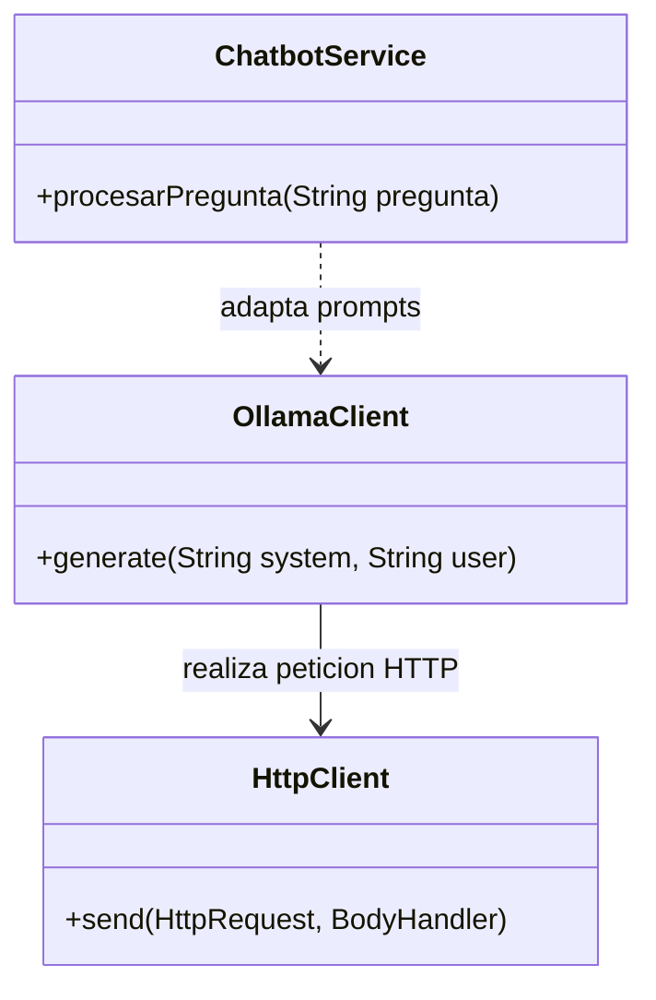

# **7\. MODELO DE DISEÑO — DIAGRAMAS UML**

## **7.1 Diagrama de Clases de Diseño (Completo)**

Muestra las clases de software reales implementadas en el backend de Spring Boot, incluyendo sus atributos, métodos principales y las relaciones existentes:

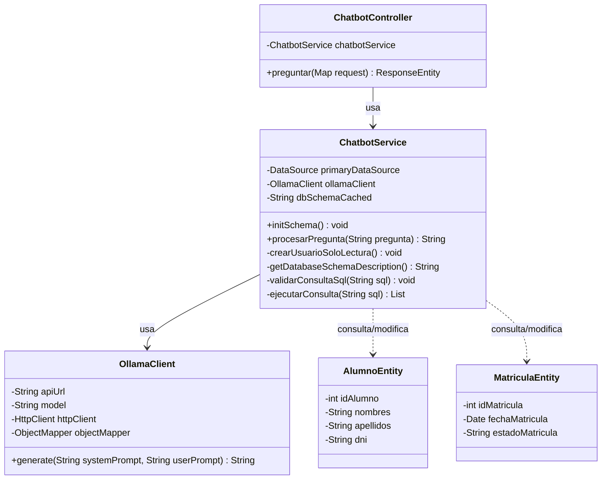

## **7.2 Diagramas de Secuencia de Diseño**

### **7.2.1 Secuencia de Diseño — UC-013: Consultar Chatbot IA**

Representa detalladamente el flujo de llamadas a nivel de código de los objetos Spring Boot y métodos JDBC implicados en el procesamiento de la pregunta:

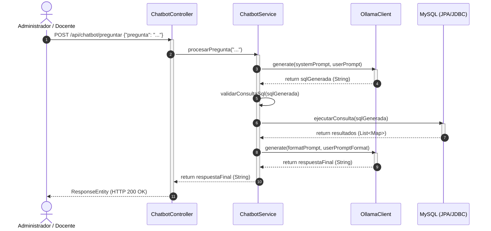

## **7.3 Diagrama de Paquetes**

Representa la distribución física y lógica de directorios del código fuente en el backend de Spring Boot:

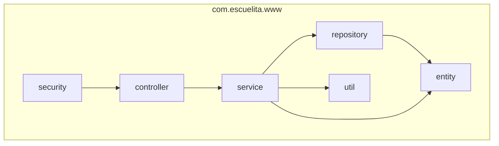

# **8\. MODELO DE DATOS (BASE DE DATOS)**

El Modelo de Datos define la estructura de la base de datos relacional del sistema ESCUELITA, implementada en MySQL. Incluye el Diagrama Entidad-Relación (ER) en notación Crow's Foot, el modelo relacional completo con diccionario de datos y el script DDL de creación.

## **8.1 Diagrama Entidad-Relación (ER)**

A continuación se presenta el diagrama Entidad-Relación físico de la base de datos **Escuela** utilizando la notación Crow's Foot:

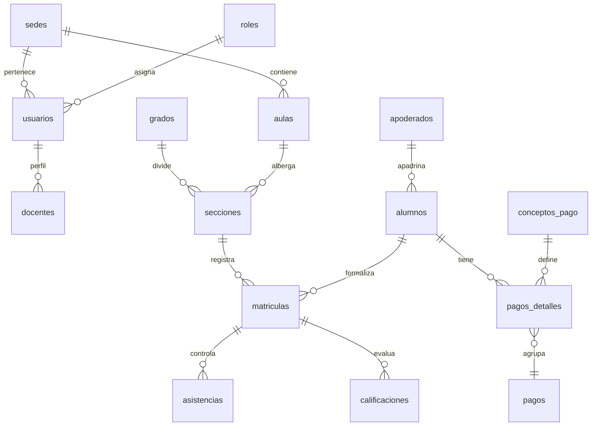

## **8.2 Modelo Relacional — Diccionario de Datos**

### **8.2.1 Tabla: `usuarios`**
Almacena las credenciales de acceso de todo el personal administrativo, docente y directivo de la institución.

| Columna | Tipo de dato | PK/FK | NULL | Default | Descripción |
| ----- | ----- | :---: | :---: | :---: | ----- |
| **id\_usuario** | INT | PK | NO | AUTO\_INCREMENT | Identificador único autoincremental de la cuenta de usuario. |
| **nombres** | VARCHAR(80) |  | NO | — | Nombres del usuario. |
| **apellidos** | VARCHAR(80) |  | NO | — | Apellidos del usuario. |
| **correo** | VARCHAR(100) |  | NO | — | Correo electrónico de inicio de sesión (único). |
| **contraseña** | VARCHAR(255) |  | NO | — | Hash encriptado con BCrypt para el acceso. |
| **id\_rol** | INT | FK | NO | — | Referencia al rol asignado (tabla `roles`). |
| **id\_sede** | INT | FK | SÍ | NULL | Referencia a la sede operativa (tabla `sedes`). |
| **estado** | TINYINT(1) |  | NO | 1 | Estado lógico de la cuenta (1 = Activo, 0 = Inactivo). |

### **8.2.2 Tabla: `alumnos`**
Contiene la información biográfica y la ficha de salud del estudiante matriculado.

| Columna | Tipo de dato | PK/FK | NULL | Default | Descripción |
| ----- | ----- | :---: | :---: | :---: | ----- |
| **id\_alumno** | INT | PK | NO | AUTO\_INCREMENT | Identificador del estudiante. |
| **nombres** | VARCHAR(80) |  | NO | — | Nombres completos del estudiante. |
| **apellidos** | VARCHAR(80) |  | NO | — | Apellidos del estudiante. |
| **dni** | VARCHAR(8) |  | NO | — | Documento Nacional de Identidad del alumno (único). |
| **fecha\_nacimiento** | DATE |  | NO | — | Fecha de nacimiento para verificar grado correspondiente. |
| **alergias\_observaciones** | TEXT |  | SÍ | NULL | Datos de salud, alergias o condiciones especiales. |

### **8.2.3 Tabla: `matriculas`**
Registra la inscripción formal del alumno en una sección y año escolar específico.

| Columna | Tipo de dato | PK/FK | NULL | Default | Descripción |
| ----- | ----- | :---: | :---: | :---: | ----- |
| **id\_matricula** | INT | PK | NO | AUTO\_INCREMENT | Identificador único de la matrícula. |
| **codigo\_matricula** | VARCHAR(20) |  | NO | — | Código único autogenerado (ej: MAT-2026-X). |
| **estado\_matricula** | ENUM(...) |  | NO | 'Pendiente\_Pago' | Estados: 'Pendiente\_Pago', 'Activa', 'Finalizada', 'Cancelada'. |
| **observaciones** | TEXT |  | SÍ | NULL | Comentarios específicos añadidos por secretaría. |
| **id\_alumno** | INT | FK | NO | — | Referencia al alumno (tabla `alumnos`). |
| **id\_seccion** | INT | FK | NO | — | Referencia a la sección (tabla `secciones`). |
| **id\_anio** | INT | FK | NO | — | Referencia al calendario escolar (tabla `anio_escolar`). |

### **8.2.4 Tabla: `docentes`**
Asocia una cuenta de usuario con el perfil pedagógico y especialidad de un docente.

| Columna | Tipo de dato | PK/FK | NULL | Default | Descripción |
| ----- | ----- | :---: | :---: | :---: | ----- |
| **id\_docente** | INT | PK | NO | AUTO\_INCREMENT | Identificador del profesor. |
| **especialidad** | VARCHAR(100) |  | NO | — | Especialidad (ej: Educación Primaria, Computación). |
| **id\_usuario** | INT | FK | NO | — | Referencia al usuario (tabla `usuarios`). |

### **8.2.5 Tabla: `calificaciones`**
Almacena el registro oficial de notas de las evaluaciones del alumno en un curso específico.

| Columna | Tipo de dato | PK/FK | NULL | Default | Descripción |
| ----- | ----- | :---: | :---: | :---: | ----- |
| **id\_calificacion** | INT | PK | NO | AUTO\_INCREMENT | Identificador único del registro de nota. |
| **valor\_nota** | DECIMAL(5,2) |  | NO | 0.00 | Calificación final numérica o ponderada. |
| **tipo\_evaluacion** | VARCHAR(50) |  | NO | — | Tipo (Examen Bimestral, Exposición, Tarea). |
| **id\_matricula** | INT | FK | NO | — | Referencia a la matrícula del alumno (tabla `matriculas`). |

## **8.3 Scripts de Creación de la Base de Datos**

El script oficial DDL de la base de datos **Escuela** se estructura de la siguiente manera:

```sql
CREATE DATABASE IF NOT EXISTS `Escuela` CHARACTER SET utf8mb4 COLLATE utf8mb4_unicode_ci;
USE `Escuela`;

-- Tabla de Roles
CREATE TABLE `roles` (
  `id_rol` INT PRIMARY KEY AUTO_INCREMENT,
  `nombre` VARCHAR(50) NOT NULL UNIQUE,
  `estado` TINYINT(1) DEFAULT 1
);

-- Tabla de Sedes
CREATE TABLE `sedes` (
  `id_sede` INT PRIMARY KEY AUTO_INCREMENT,
  `nombre_sede` VARCHAR(100) NOT NULL,
  `direccion` VARCHAR(150),
  `telefono` VARCHAR(15),
  `estado` TINYINT(1) DEFAULT 1
);

-- Tabla de Usuarios
CREATE TABLE `usuarios` (
  `id_usuario` INT PRIMARY KEY AUTO_INCREMENT,
  `nombres` VARCHAR(80) NOT NULL,
  `apellidos` VARCHAR(80) NOT NULL,
  `correo` VARCHAR(100) NOT NULL UNIQUE,
  `contraseña` VARCHAR(255) NOT NULL,
  `id_rol` INT NOT NULL,
  `id_sede` INT,
  `estado` TINYINT(1) DEFAULT 1,
  FOREIGN KEY (`id_rol`) REFERENCES `roles`(`id_rol`),
  FOREIGN KEY (`id_sede`) REFERENCES `sedes`(`id_sede`)
);

-- Tabla de Alumnos
CREATE TABLE `alumnos` (
  `id_alumno` INT PRIMARY KEY AUTO_INCREMENT,
  `nombres` VARCHAR(80) NOT NULL,
  `apellidos` VARCHAR(80) NOT NULL,
  `dni` VARCHAR(8) NOT NULL UNIQUE,
  `fecha_nacimiento` DATE NOT NULL,
  `alergias_observaciones` TEXT,
  `estado` TINYINT(1) DEFAULT 1
);

-- Tabla de Matrículas
CREATE TABLE `matriculas` (
  `id_matricula` INT PRIMARY KEY AUTO_INCREMENT,
  `codigo_matricula` VARCHAR(20) NOT NULL UNIQUE,
  `estado_matricula` ENUM('Pendiente_Pago', 'Activa', 'Finalizada', 'Cancelada') NOT NULL DEFAULT 'Pendiente_Pago',
  `observaciones` TEXT,
  `id_alumno` INT NOT NULL,
  `id_seccion` INT NOT NULL,
  `id_anio` INT NOT NULL,
  FOREIGN KEY (`id_alumno`) REFERENCES `alumnos`(`id_alumno`),
  FOREIGN KEY (`id_seccion`) REFERENCES `secciones`(`id_seccion`),
  FOREIGN KEY (`id_anio`) REFERENCES `anio_escolar`(`id_anio`)
);
```

El script DDL completo (con todas las tablas, claves foráneas e inserts iniciales de roles y administrador) se encuentra en el **Apéndice A** de este documento.

# **9\. PROTOTIPOS DE INTERFAZ DE USUARIO**

## **9.1 Guía de Estilo Visual**

Para garantizar una experiencia de usuario consistente, moderna y accesible en la plataforma **ESCUELITA**, se ha definido la siguiente guía de estilos visuales:

| Elemento | Especificación | Ejemplo / Muestra |
| ----- | ----- | ----- |
| **Color primario** | `#1E3A8A` — Azul Institucional | Botones principales, cabeceras de tablas, menús laterales. |
| **Color secundario** | `#0D9488` — Verde Teal | Acciones secundarias, indicadores de éxito, badges. |
| **Color de fondo** | `#F3F4F6` — Gris Claro Neutral | Fondo de la aplicación y paneles contenedores. |
| **Color de alerta** | `#EF4444` — Rojo Alerta | Errores de validación, deudas vencidas, alertas de seguridad. |
| **Color de éxito** | `#10B981` — Verde Confirmación | Matrículas activas, pagos registrados con éxito. |
| **Tipografía principal** | `Inter` (Google Fonts) — H1=24px, H2=18px, Body=14px | Texto general legible en pantallas de escritorio. |
| **Bordes / Tarjetas** | `Border-radius: 8px`, `Box-shadow: 0 4px 6px -1px rgba(0,0,0,0.1)` | Contenedores de información y tarjetas de Dashboard. |
| **Iconografía** | `Lucide React Icons` (Settings, Users, BookOpen, DollarSign) | Iconos descriptivos para navegación y acciones rápidas. |

## **9.2 Mapa de Navegación**

El mapa de navegación de la Single Page Application (SPA) construida en React estructura los flujos de pantallas según los roles autorizados:

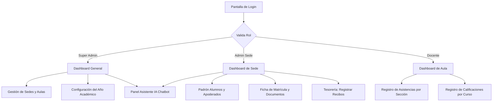

## **9.3 Prototipos por Módulo**

### **9.3.1 Pantalla: Login / Inicio de Sesión**
Es la puerta de acceso al sistema, protegida contra fuerza bruta.

| Componente / Elemento | Tipo UI | Comportamiento / Validación |
| ----- | ----- | ----- |
| **Logo de la I.E. Saber Wassi** | Imagen | Logotipo escolar en alta definición. |
| **Campo: Correo Electrónico** | Input email | Requerido, valida formato de correo electrónico. |
| **Campo: Contraseña** | Input password | Requerido, encriptación en tránsito. |
| **Botón: Ingresar** | Button primary | Dispara la llamada a `/api/auth/login`. |
| **Mensaje de error** | Alert rojo | Aparece al ingresar credenciales erróneas (ej: "Usuario inactivo" o "Contraseña incorrecta"). |

### **9.3.2 Pantalla: Dashboard de Sede (Administrador)**
Panel consolidado que muestra estadísticas operativas del colegio en tiempo real.
*   **KPIs centrales**: Alumnos Matriculados en el Año Vigente, Docentes Activos en Sede, Aulas Utilizadas, Ingresos Recaudados en el mes.
*   **Acciones rápidas**: Botón de "Nueva Matrícula", botón de "Ver Estado de Caja".

### **9.3.3 Pantalla: Ficha de Matrícula (Módulo MMT)**
Formulario estructurado en pestañas (Wizard) para registrar la matrícula de un alumno:
*   **Pestaña 1: Datos del Alumno**: DNI, nombres, apellidos, fecha de nacimiento, grupo sanguíneo, alergias e historial médico.
*   **Pestaña 2: Vinculación con Apoderado**: Búsqueda del apoderado por DNI e indicación del parentesco.
*   **Pestaña 3: Configuración Académica**: Selección del año escolar, grado, sección y aula. Valida dinámicamente las vacantes libres.
*   **Pestaña 4: Carga Documentaria**: Zona de drag & drop para subir escaneos obligatorios de documentos en PDF o JPG.

### **9.3.4 Pantalla: Panel de Asistente IA Chatbot**
La interfaz conversacional integrada que permite realizar consultas e instrucciones en lenguaje natural.
*   **Caja de Chat**: Historial visual de la conversación con globos diferenciados (Usuario en azul, Chatbot en verde).
*   **Caja de Texto**: Input donde el administrador escribe la pregunta (ej: *"¿Qué alumnos tienen promedios desaprobados en Álgebra?"* o *"Modifica las observaciones de la matrícula MAT-2026-5149..."*).
*   **Botón Enviar**: Envía la solicitud al endpoint REST backend.
*   **Área de Respuesta**: Renderiza la respuesta redactada de forma amigable por el modelo `qwen2.5:7b` de Ollama. Si es una operación bloqueada (ej: borrar una tabla), muestra el cartel de error 403.

---

# **10\. MATRIZ DE TRAZABILIDAD**

| ID Requerimiento | Descripción corta | Caso de Uso | Componentes / Clases Java | Tabla de BD | Pantalla / Prototipo |
| ----- | ----- | ----- | ----- | ----- | ----- |
| **MSC-01** | Inicio de sesión | UC-001 | `AdminAuthController`, `JwtFilter` | `usuarios`, `roles` | Pantalla de Login |
| **MIA-02** | Configuración de Sede | UC-003 | `SedeService`, `SedeRepository` | `sedes` | Gestión de Sedes |
| **MGD-03** | Asignación Docente | UC-008 | `DocenteService`, `Seccion` | `docentes`, `secciones` | Carga Académica |
| **MMT-04** | Registro de Matrícula | UC-002 | `MatriculaController`, `ChatbotService` | `matriculas`, `alumnos` | Ficha de Matrícula |
| **MCE-05** | Evaluación y Notas | UC-009 | `CalificacionService`, `Calificacion` | `calificaciones` | Registro de Calificaciones |
| **MTF-06** | Control de Caja | UC-011 | `PagoController`, `ConceptoPago` | `pagos`, `pagos_detalles` | Caja y Aranceles |
| **MIA-07** | Chatbot Inteligente | UC-013 | `ChatbotController`, `ChatbotService`, `OllamaClient` | Todas (Esquema y Permisos) | Panel de Asistente IA |

---

# **11\. GLOSARIO DE TÉRMINOS**

*   **Año Escolar**: Periodo anual oficial de clases escolares dividido administrativamente en bimestres o trimestres.
*   **Apoderado**: Persona legalmente responsable del estudiante ante la institución, encargada de la matrícula y la facturación.
*   **Calificación**: Calificación del rendimiento estudiantil en base a la escala del MINEDU (Literal A, B, C, AD).
*   **Chatbot IA**: Agente inteligente integrado basado en el modelo local Qwen 2.5 que traduce instrucciones en lenguaje natural a código SQL seguro.
*   **Diccionario de Datos**: Documento técnico detallado que define los tipos de datos, restricciones y propósitos de las tablas de la base de datos MySQL.
*   **Ficha Multisección**: Formulario digital de matrícula del alumno estructurado para recopilar datos de contacto, médicos e historial legal.
*   **Sede**: Ubicación física del colegio (ej: Sede Principal, Sede Anexo) con sus respectivas aulas físicas asignadas.
*   **SIAGIE**: Sistema de Información de Apoyo a la Gestión de la Institución Educativa (portal oficial del Estado Peruano).
*   **Token JWT (JSON Web Token)**: Cadena encriptada para la autenticación sin estado en el backend, conteniendo el rol y la sede del usuario.

---

# **12\. APÉNDICES Y FIRMAS**

## **Apéndice A — Scripts SQL de Creación de BD**
El script SQL completo para la creación lógica de la base de datos, relaciones de llaves foráneas y datos iniciales de configuración se encuentra adjunto en el archivo de recursos de base de datos del proyecto: [data.sql](file:///c:/xampp/htdocs/Proyecto_Escuela/escuelita-backend/src/main/resources/data.sql).

## **Apéndice B — Prototipos en Alta Fidelidad**
Los diseños e interacciones de la aplicación web del colegio Saber Wassi en alta fidelidad y el flujo interactivo de pantallas para la matrícula y el Chatbot IA se encuentran disponibles en el Figma del proyecto.

## **Apéndice C — Cronograma de Desarrollo (Iteraciones)**

| Sprint | Fechas | Módulos y Funcionalidades (RFs) | Entregable Funcional | Responsable |
| ----- | ----- | ----- | ----- | ----- |
| **Sprint 1** | Iteración 1 | Seguridad (MSC) e Infraestructura Académica (MIA). | Login + Creación de Sedes, Grados y Secciones. | Grupo 01 |
| **Sprint 2** | Iteración 2 | Gestión Docente (MGD) y Registro del Padrón (MMT). | Asignación de Carga Horaria y Registro de Alumnos. | Grupo 01 |
| **Sprint 3** | Iteración 3 | Procesamiento de Matrículas (MMT) y Caja Inicial (MTF). | Ficha de Matrícula + Carga de Documentos PDF. | Grupo 01 |
| **Sprint 4** | Iteración 4 | Evaluaciones y Notas (MCE) y Recaudación (MTF). | Registro de Calificaciones por Bimestre y Recibos. | Grupo 01 |
| **Sprint 5** | Iteración 5 | Integración del Agente IA Chatbot (Ollama API local). | Chatbot conversacional con restricciones SQL activas. | Grupo 01 |

## **Apéndice D — Informe de Revisión Técnica (RTF)**

| Rev. N° | Fecha | Revisor | Observaciones | Estado |
| ----- | ----- | ----- | ----- | ----- |
| **R-001** | 17/06/2026 | Marco Antonio Reategui B. | Revisión del esquema ER de base de datos escolar. | ✅ Aprobado |
| **R-002** | 11/07/2026 | Brayam Arista Fernández | Integración del Chatbot con permisos mixtos e IA local. | ✅ Aprobado |

## **Apéndice E — Firmas y Aprobación**

| Elaborado por (Equipo de Software) | Revisado y Aprobado por (Docente / Cliente) |
| ----- | ----- |
| **Brayam Arista Fernández**<br>Firma: ________________________ Fecha: 11/07/2026 | **Representante I.E. Saber Wassi**<br>Cargo: Director General<br>Firma: ________________________ Fecha: 11/07/2026 |
| **Brayan Joseph Ramirez Cervan**<br>Firma: ________________________ Fecha: 11/07/2026 | **Docente de Lenguaje de Programación III**<br>Cargo: Evaluador Principal<br>Firma: ________________________ Fecha: 11/07/2026 |
| **Marco Antonio Reategui Bojorquez**<br>Firma: ________________________ Fecha: 11/07/2026 | |
| **Nayelli Yuley Arevalo Romero**<br>Firma: ________________________ Fecha: 11/07/2026 | |
| **Luis Alberto Yajahuanca Fernández**<br>Firma: ________________________ Fecha: 11/07/2026 | |